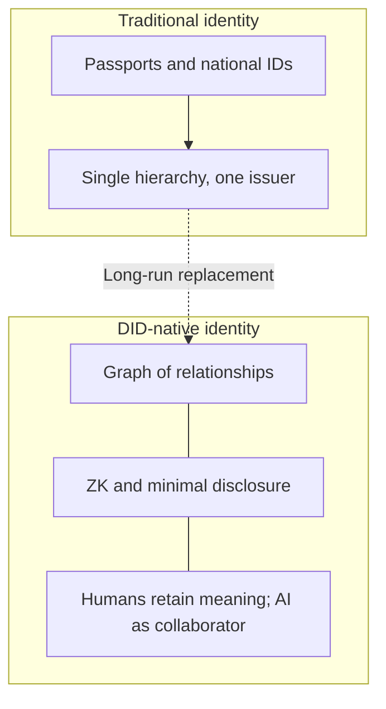
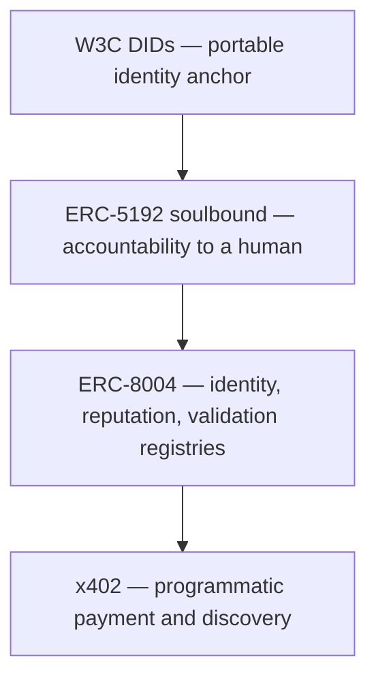
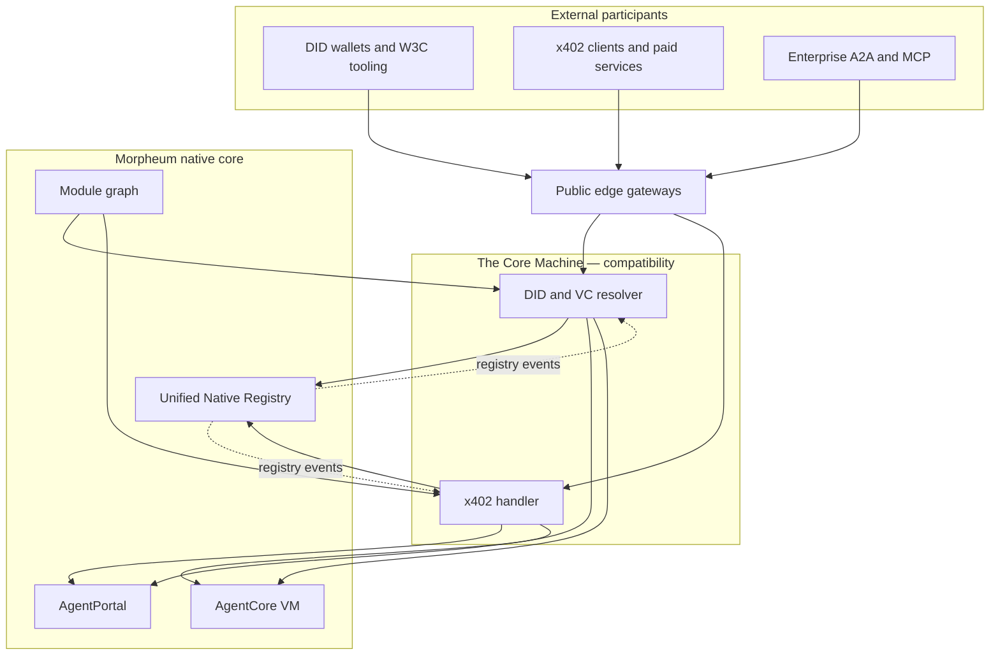
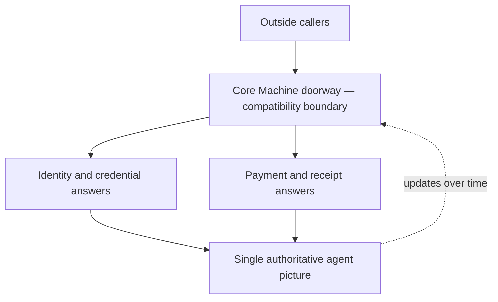
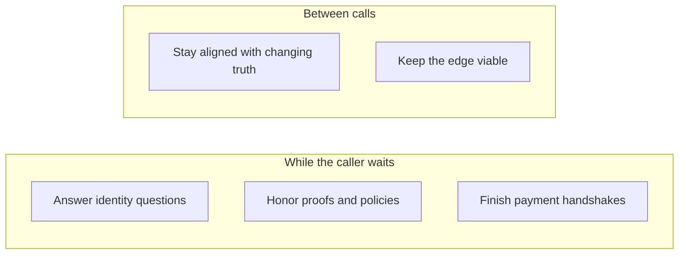
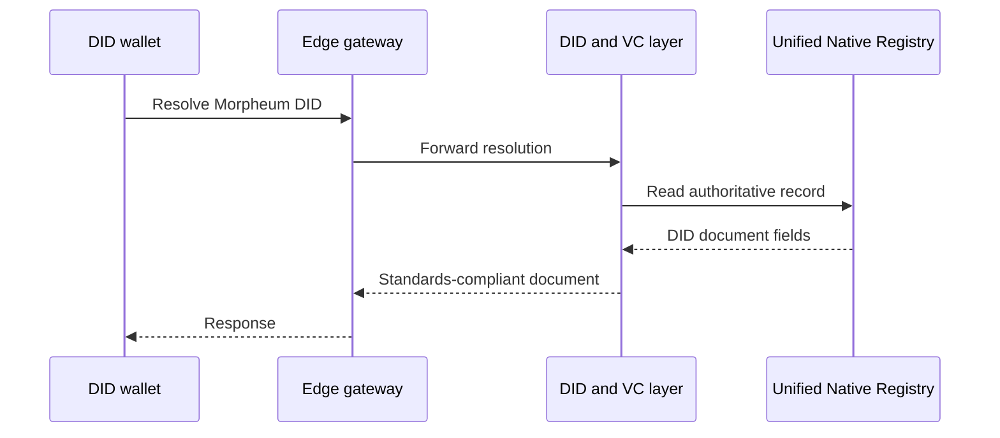
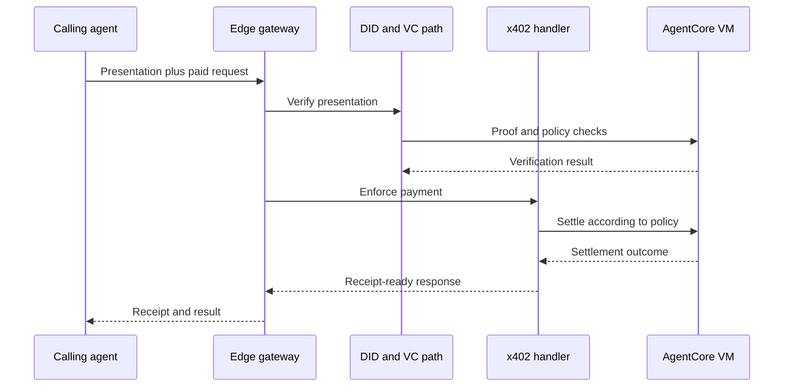
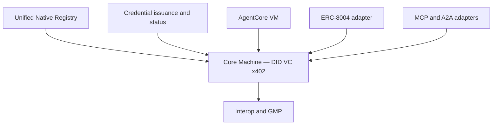

# Know Your Agent: Portable Identity, Machine Accountability, and the Compatibility Boundary

*Decentralized identifiers, agent registries, interoperability layers, and the awkward middle ground between “no passport” and “treat the bot like a customer.”*

**Morpheum Labs — Research**  
*April 30, 2026*

---

## Abstract

Autonomous agents are increasingly treated as **first-class** participants in digital markets, yet identity and accountability remain fragmented across national credentials, platform logins, and ad hoc API keys. This paper argues—**tentatively but, I think, usefully**—that **Decentralized Identifiers (DIDs)** and **Verifiable Credentials (VCs)**, together with **non-transferable accountability**, **on-chain agent registries**, and **programmatic payment** conventions, can be read as a coherent **Know Your Agent (KYA)** framework: **not** a literal mirror of Know Your Customer (KYC), but **analogous** in the sense of bundling institutional-style assurance questions for non-human actors. We synthesize long-horizon public commentary favoring DID-centric identity graphs and selective disclosure, and relate that vision to emerging Ethereum-adjacent standards for agents and **HTTP 402**–style payment challenges. We then describe **the Core Machine**, Morpheum’s **compatibility layer**, as an architectural pattern: standards-facing resolution and payment surfaces backed by a **unified registry** and **execution runtime**, aiming for chain-agnostic discovery and settlement **without** maintaining duplicate authoritative state at the edge. Finally, we discuss **post-quantum** migration as a **long-horizon** requirement for cryptographic roots. The contribution is **conceptual and architectural**: we unify discourse on DIDs, KYA, and interoperability into one narrative with diagrams, and we state design **invariants** suitable for peer review—without claiming empirical superiority over alternative stacks.

**Keywords:** decentralized identifiers; verifiable credentials; Know Your Agent; agent economies; ERC-8004; soulbound tokens; HTTP 402; x402; interoperability; compatibility layer; Core Machine; post-quantum cryptography.

---

## 1. Introduction

### 1.1 Motivation

Software agents already route messages, trade, curate content, and execute workflows. As autonomy and economic agency increase, counterparties need answers to questions that human onboarding used to monopolize: *who stands behind this actor?*, *what proofs exist for capabilities and constraints?*, *how should payment and liability be wired?* **Know Your Agent (KYA)** is a convenient name for that **bundle**—knowing it is a bundle matters, because no single primitive solves every case.

Parallel work on **Decentralized Identifiers (DIDs)** (W3C, 2022) supplies portable, cryptographically verifiable anchors not tied to one issuer directory. **Verifiable Credentials** add selective disclosure and third-party attestation—powerful, but not free operationally (revocation and status lists remain friction). Ethereum community standards propose **on-chain agent registries** combining identity, reputation, and validation (ERC-8004; see ecosystem documentation), and **non-transferable** interfaces (ERC-5192) echo “soulbound” accountability metaphors (Ohlhaver et al., 2022). Payment layers that expose machine-readable **402 Payment Required** flows—often discussed under labels such as **x402**—complete a picture of agents that are, in principle, **discoverable, payable, and verifiable**.

The value of this combination should not be overstated: **standards do not equal adoption**, and **adoption does not equal good policy**. Still, the pieces are real enough to analyze as a stack.

### 1.2 Problem statement

The gap addressed here is **integration**, not the mere existence of specifications. Individual documents define fragments; operators still pay **translation cost**: wallets and enterprise stacks speak W3C shapes and HTTP idioms, while native runtimes optimize internal state. Without a disciplined compatibility boundary, the likely outcomes are familiar—**fork the standard awkwardly**, or **strand agents in silos**. Neither is a law of nature; both are shaped by incentives and engineering budgets.

### 1.3 Contributions

This paper makes three contributions:

1. **A layered KYA model** that sequences DIDs, binding/accountability, on-chain registries, and programmable payment rails—useful, I think, as a **scaffolding** for agent-to-agent economies, not as a finished compliance regime.  
2. **A synthesis of long-horizon DID-centric identity discourse** (including public interview commentary attributed to Buterin, 2026, summarized here from secondary sources) with concrete identifiers (W3C, ERC-5192, ERC-8004, HTTP 402 conventions).  
3. **An architectural case study of the Core Machine**, described as a **thin compatibility layer** with explicit **invariants** (single source of truth, execution-mediated verification and settlement, stateless edge behavior), illustrated with **structure and sequence** diagrams.

### 1.4 Paper organization

Section 2 reviews related work. Section 3 develops conceptual foundations. Section 4 formalizes the KYA framework. Section 5 presents the Core Machine architecture and flows. Section 6 discusses limitations and threats. Section 7 concludes. An appendix notes implementation sequencing.

---

## 2. Related Work

**DIDs and DID documents.** The W3C DID specification defines globally unique identifiers and associated documents carrying verification relationships and service endpoints (W3C, 2022). Implementations span multiple **did methods**; interoperability depends on resolver transparency and method governance—another place where “decentralized” does not automatically mean “simple.”

**Verifiable Credentials.** The VC data model separates **issuer**, **holder**, and **verifier** roles and supports privacy-enhancing presentation patterns (W3C, 2022). Status mechanisms and revocation lists remain operational concerns for production deployments.

**Soulbound tokens and decentralized society.** Buterin (2022), with coauthors, frames non-transferable “soulbound” tokens as building blocks for pluralistic, community-relative reputation—conceptually adjacent to **non-transferable agent identity** and accountability hooks in KYA, though the politics of **binding** humans to bots deserves careful treatment.

**On-chain agent registries.** ERC-8004 (draft→deployment narratives as of 2025–2026) organizes **identity**, **reputation**, and **validation** registries for agents; it is positioned as infrastructure for **trust-minimized** discovery and auditing—**trust-minimized**, not **trust-free**.

**Programmatic payment and HTTP 402.** The HTTP 402 status code historically lacked one universal semantics; recent **agent-economy** proposals revive **402** as a machine-readable payment challenge pattern, often discussed alongside Coinbase-originating SDK ecosystems (industry sources, 2025–2026). We treat **x402** as a **representative label** for that class of mechanisms without endorsing a single implementation as normative.

**Interoperability layers.** Middleware mapping external protocols to internal authoritative services appears across identity federation (e.g., SAML/OIDC bridges) and blockchain **relayers**; the Core Machine is analogous in **intent**—standards at the edge, authoritative state internally—while specializing to **DID/VC** and **402-class payments**.

**Post-quantum readiness.** National Institute of Standards and Technology (NIST) standardization of module-lattice and hash-based schemes motivates **hybrid** classical/post-quantum signatures for long-lived identities (NIST, 2024). “Harvest now, decrypt later” motivates migration **even before** cryptanalytically decisive quantum machines arrive—a threat model worth taking seriously for **long-lived** identifiers.

---

## 3. Conceptual Foundations

### 3.1 From hierarchical credentials to graph-native identity

Public commentary on long-horizon identity—exemplified by a 2026 ETHPanda interview with Buterin (Chinese-language; summarized here from internal research notes)—suggests that **physical national IDs** and strictly hierarchical issuer trees may **lose centrality** relative to **DID-based** systems. Identity is portrayed as a **graph**: trust propagates along multiple paths; localized failure or compromise does not necessarily collapse the whole subject’s ability to authenticate context-appropriate claims. **Plausibly** useful—also **plausibly** messy for regulators and for users who benefit from simple defaults.

**Privacy** is addressed through **zero-knowledge proofs** and **minimal disclosure**: subjects demonstrate predicates (“human in this context,” “sufficient reputation in domain *d*”) without revealing full attribute vectors. **Reputation** is **multi-dimensional** and **community-relative**, resisting reduction to a single global score—by design, but also at the cost of interpretability.

**AI** is framed (in the summarized commentary) as augmenting human autonomy when bounded by accountability; unconstrained autonomy is treated skeptically in favor of **human meaning** and **oversight**. I think that posture is **directionally right** as a design instinct, even where implementation lags philosophy.

We emphasize again: this subsection **summarizes interpretive notes** on public remarks; it is **not** a primary transcript analysis.

**Figure 1. Conceptual shift (centralized vs DID-native identity).**

---

## 4. The KYA Framework

### 4.1 Definition

**Know Your Agent (KYA)** denotes policies, proofs, and registries that let verifiers decide whether to admit an autonomous agent to **sensitive actions** (payments, data access, cross-org messaging) with **machine-checkable** evidence and **traceable accountability**. It is **policy**, not physics: different organizations will weight proofs differently.

### 4.2 Layered stack

We model KYA as four conceptual layers (Figure 2):

1. **Anchor layer — DIDs.** Portable identifiers and DID documents (W3C, 2022).  
2. **Accountability layer — binding.** Non-transferable association between agent identity and a responsible human or organization (metaphorically **soulbound**; ERC-5192-style interfaces).  
3. **Discovery and audit layer — registries.** On-chain identity, reputation, and validation records (ERC-8004 class).  
4. **Economic layer — programmatic payment.** HTTP 402–class challenges and settlement paths enabling **pay-per-call** or policy-gated access (**x402** as representative industry pattern).

**Figure 2. KYA stack.**

Let’s recap: the stack is **deliberately sequential** in exposition—real deployments may partially collapse layers or duplicate functions across vendors.

---

## 5. Architectural Case Study: The Core Machine

### 5.1 Positioning

**The Core Machine** denotes Morpheum’s **compatibility layer**: the controlled boundary where **external** standards (DID resolution, VC/VP verification, 402-class payments) meet **internal** authoritative state and execution. Morpheum describes this as **day-zero** infrastructure—planned from initial architecture rather than retrofitted. That choice has costs (rigidity early) and benefits (fewer “two truths” failures later).

Formally, let **S** be authoritative agent state in a **Unified Native Registry**, **E** an execution engine (**AgentCore VM**), and **G** edge **gateways**. The Core Machine provides functions conceptually of the form **resolve(did) → document**, **verify(vp, policy) → verdict**, and **pay(req) → receipt**, each **derived from S** and **mediated by E** where proofs or settlement require native semantics.

### 5.2 Plain-language role

The Core Machine answers three recurring external questions—**who is this agent?**, **is this credential acceptable?**, **how is this call paid?**—using **one** internal source of truth, then returning **standards-shaped** responses. It is **not** a parallel registry; duplication would undermine auditability and consistency—the least convenient world here is an operator quietly maintaining shadow state.

### 5.3 System context

Figure 3 places gateways, Core Machine modules, registry, execution, and module graph.

**Figure 3. The Core Machine in system context.**

**Stated invariants** (design targets for verification):

- DID documents and 402-class payloads are **materialized from S**, not authored ad hoc at operators’ discretion.  
- **Verification** of presentations and **settlement** of payments pass through **E** where policy requires.  
- **Portability**: Morpheum’s DID method and payment paths remain usable across deployment variants and bridged asset policies described by S.

### 5.4 Internal shape (conceptual)

Internally, the Core Machine is best understood as **one doorway**, not a maze of bespoke pipes. Outside traffic arrives at the edge; the compatibility layer **sorts intent at a high level**—roughly, “prove who this is” versus “settle how this is paid”—while both lanes **draw answers from the same authoritative picture** of agents and policies. Over time, that picture moves as registries and runtime state evolve; the layer’s job is to **stay aligned** so external callers do not observe drift or duplicate truths. No further decomposition is essential for the argument of this paper; implementation specifics remain vendor-internal.

**Figure 4. Conceptual interior (doorway, two concerns, one truth).**

### 5.5 What happens now versus what happens in the background

Some work answers **the request in front of us** (resolve an identity question, check a proof, complete a payment handshake). Other work **keeps the system honest between requests**—refreshing views when authoritative state changes and maintaining the health of the edge. The distinction matters conceptually—**interactive assurance** versus **ongoing housekeeping**—without committing this paper to operational detail.

**Figure 5. Interactive work vs housekeeping (schematic).**

### 5.6 Sequence: DID resolution

**Figure 6. DID resolution sequence.**

### 5.7 Sequence: presentation and payment

**Figure 7. Verifiable presentation with x402-style payment.**

### 5.8 Adjacent pillars

Figure 8 summarizes dependencies described in Morpheum design notes (registry, credential issuance and status, VM, ERC-8004 adapter, MCP/A2A, interoperability).

**Figure 8. The Core Machine relative to adjacent pillars.**

---

## 6. Discussion

### 6.1 Trust and governance

Even with DIDs and registries, **gateway operators** and **method governance** introduce trust assumptions. Academic readers should treat edge gateways as **policy enforcement points**: their compromise affects availability and integrity of external-facing responses unless independently auditable against S. **Decentralization** of identifiers does not automatically decentralize **who runs the door**.

### 6.2 Standardization volatility

ERC-8004, soulbound interfaces, and 402-class payment SDKs remain **moving targets**. The Core Machine’s value proposition assumes **stable mapping** from S to standards; churn in upstream specs imposes **maintenance tax**—an ordinary engineering tax, but real.

### 6.3 Privacy composition

VC selective disclosure and ZK proofs mitigate leakage, but **correlation** across repeated gateway calls and on-chain registry writes remains a **privacy research** problem. On balance, privacy tools help at the margin; they do not erase observability economics.

### 6.4 Post-quantum migration

Long-lived DID keys and registry-backed reputations are vulnerable to **harvest-now, decrypt-later** adversaries. Hybrid classical/post-quantum signatures (NIST, 2024) are a pragmatic migration path; KYA and Core Machine–like layers must **not hard-code** legacy curves as permanent roots of trust.

**Figure 9. Cryptography posture over time.**

---

## 7. Conclusion

Decentralized identifiers and verifiable credentials supply **portable anchors** for agents; binding and registries supply **accountability and auditability**; programmatic payment supplies **economic composability**—each piece negotiates trade-offs the paper has tried to surface rather than hide. **The Core Machine** instantiates a recurring pattern—**standards at the boundary, authority internally**—that may reduce fragmentation **without** duplicating truth, if invariants hold under operations.

Forward-looking work that would genuinely bite includes **formal verification** of mapping invariants, **empirical latency** and **availability** studies under load, and **comparative analysis** with alternative agent-identity stacks. Open questions remain: how much **human binding** is socially desirable for powerful agents, and how **interoperability layers** behave when upstream standards fork. I think those questions will age better than victor’s-history narratives about any single chain.

---

## References

Ohlhaver, P., Weyl, E. G., & Buterin, V. (2022). *Decentralized society: Finding Web3’s soul* (SSRN Scholarly Paper No. 4105763). https://doi.org/10.2139/ssrn.4105763  

Ethereum Improvement Proposals. ERC-5192: Minimal Soulbound NFTs. Retrieved from https://eips.ethereum.org/EIPS/eip-5192  

Ethereum Improvement Proposals. ERC-8004: Trustless Agents (identity, reputation, validation registries). Retrieved from https://eips.ethereum.org/EIPS/eip-8004  

National Institute of Standards and Technology. (2024). *FIPS 203, 204, 205* (post-quantum cryptography standards). Retrieved from https://csrc.nist.gov/projects/post-quantum-cryptography  

W3C. (2022). *Decentralized Identifiers (DIDs) v1.0.* W3C Recommendation. Retrieved from https://www.w3.org/TR/did-core/  

W3C. (2022). *Verifiable Credentials Data Model v1.1.* W3C Recommendation. Retrieved from https://www.w3.org/TR/vc-data-model/  

Buterin, V. (2026). *ETHPanda Talk* [video interview, Chinese]. Identity and DIDs discussed circa 00:01:53 (summarized secondarily in Morpheum internal research notes; transcript-independent claims should cite primary recording when available).  

Industry documentation. (2025–2026). HTTP 402 / x402 agent payment SDKs and specifications (representative implementation ecosystem; cite specific vendor documentation for implementation-level claims).  

Morpheum Labs. (2026). Internal architecture notes: the Core Machine (compatibility layer), unified registry, AgentCore VM, MormFabric runtime (design lock referenced March 2026 in engineering documentation).  

---

## Appendix A. Implementation sequencing (summary)

Engineering notes attached to this line of work describe a short phased rollout: land DID/VC resolution, land x402 handling and gateway integration, harden registry synchronization, and execute end-to-end verification scenarios. **Authoritative** build and test procedures reside with Morpheum source repositories; this appendix records **intent** only.

---

## Scholarly note on sources

The informal working compilation that backed diagram drafting and interview timestamps is preserved as **`did-kya-research-notes.md`** in this directory for traceability; **this file** is the canonical academic draft.
