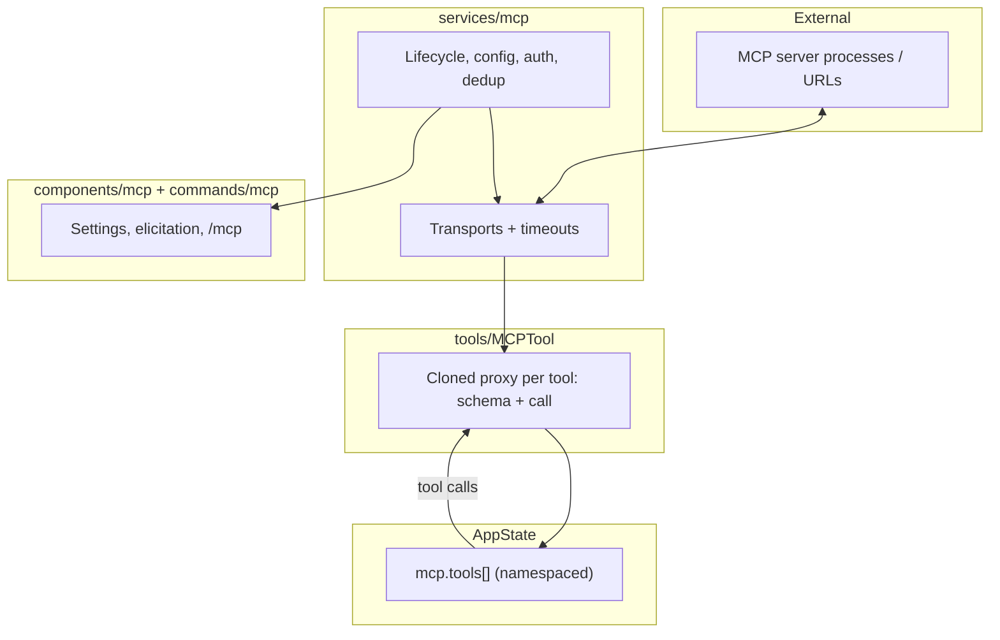
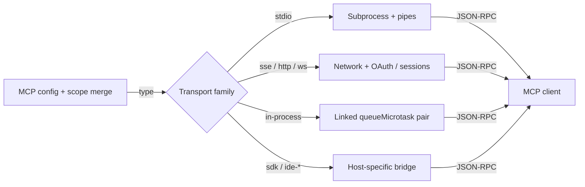
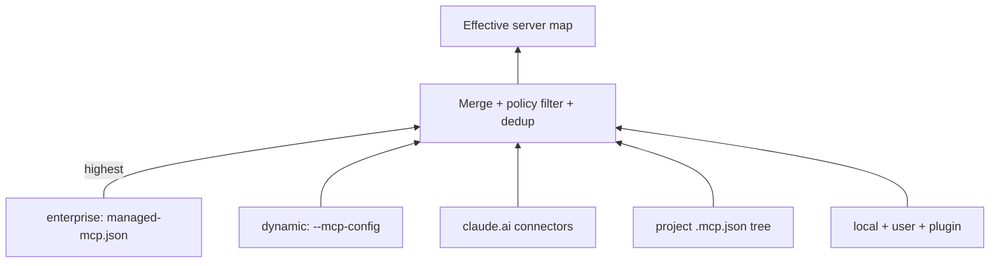
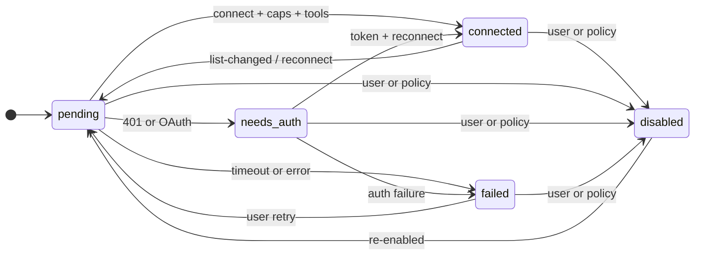
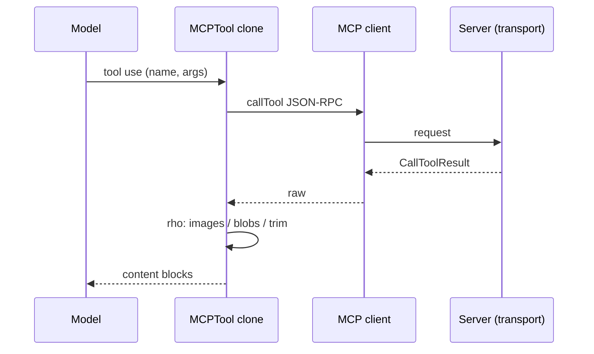
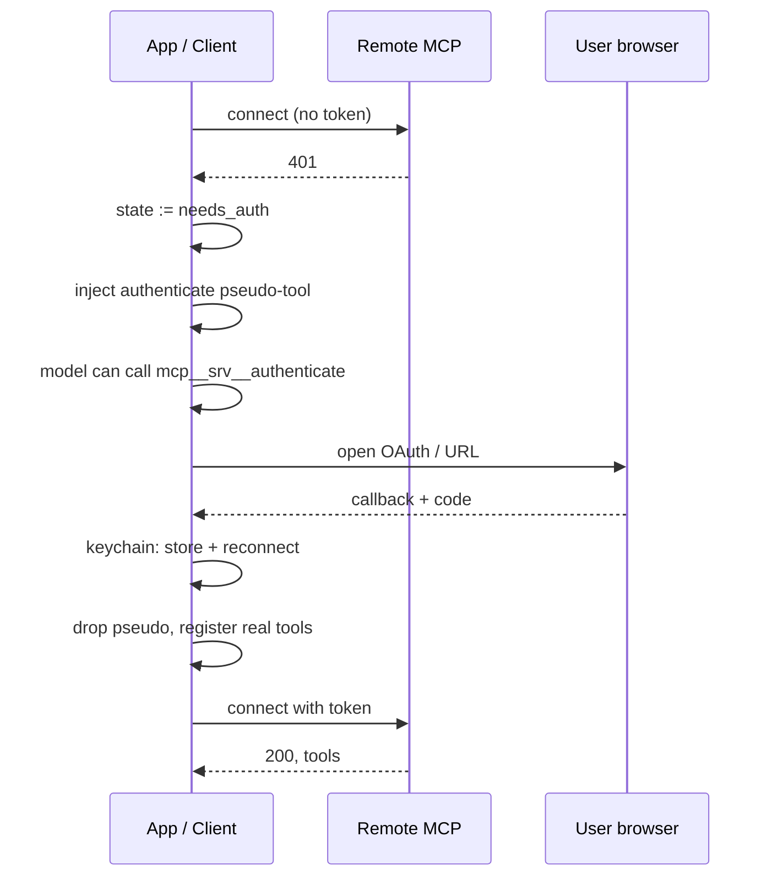
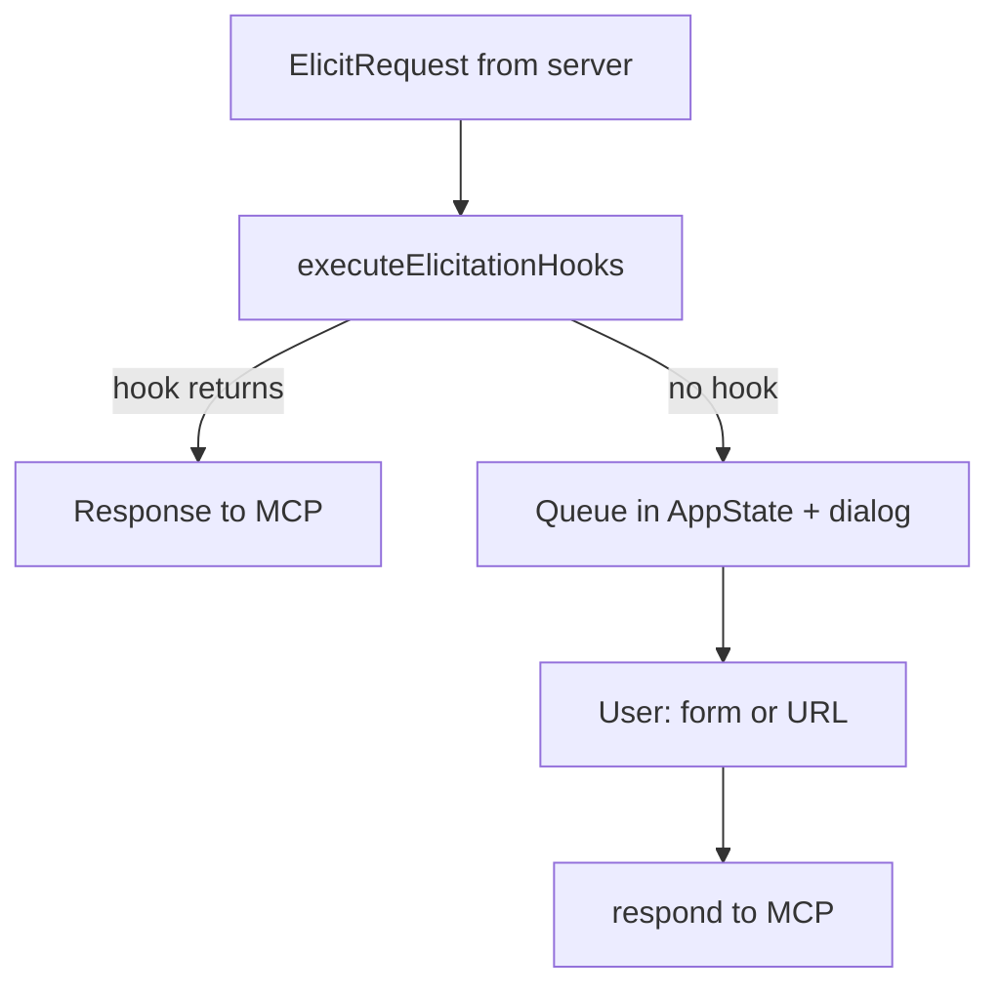
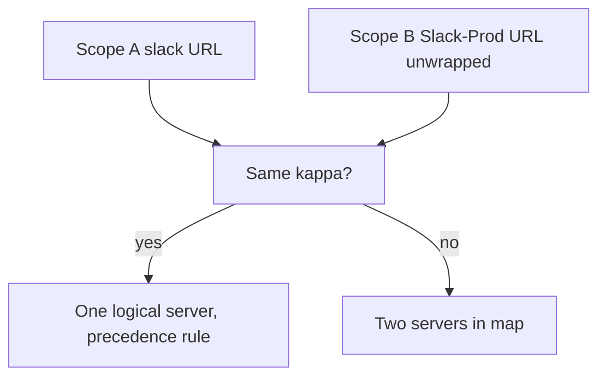
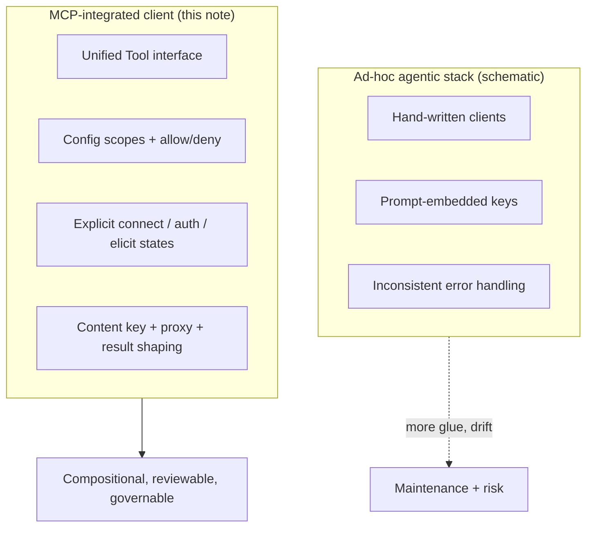

**Model Context Protocol as the Integration Substrate in Claude Code: Architecture, Guarantees, and Contrast with Ad-Hoc Agentic Tooling**

**Author:** Morpheum research  
**Date:** April 23, 2026  
**Primary source:** [mdENG — Lesson 07: MCP Integration System](https://www.markdown.engineering/learn-claude-code/07-mcp-system) (source deep dive of Claude Code’s MCP stack)

### Abstract

Claude Code treats the **Model Context Protocol (MCP)** not as an optional plugin surface but as a **first-class tool plane**: every MCP server’s tools are registered through the same `Tool` interface as built-in capabilities (for example, file and shell tools), with stable namespacing (`mcp__<server>__<tool>`). This note argues that such a design is **architecturally central** to reliable, governable, and extensible agentic coding: it separates **protocol** (how tools are discovered, invoked, and secured) from **policy** (who may use which server, in which scope), and it unifies **local processes**, **remote transports**, and **in-process bridges** under one lifecycle. We summarize the stack—transports, configuration cascade, connection state machine, proxy layer, OAuth and elicitation, deduplication—and contrast it with **ad-hoc** agent designs that hard-code integrations or expose unconstrained shell escape hatches. The comparison highlights **standardized capability negotiation**, **content-addressed server identity**, **model-triggerable authentication with secure token storage**, and **explicit user-in-the-loop elicitation**, which together yield a more **advanced** and **operationally defensible** agent architecture than one-off tool lists or prompt-only “function calling” without shared operational semantics.

**Keywords:** Model Context Protocol, agent architecture, tool routing, OAuth PKCE, configuration management, extensibility, governance.

### Notation and figures

**Display** mathematics uses `\[ \]`; **inline** uses `\( \)`. **Mermaid** diagrams are **schematic** (not line-accurate source maps). They condense the relationships the body text explains.

---

## 1. Introduction

**Agentic** coding assistants need to act on the world: read repositories, call APIs, use browsers, and interact with org-specific systems. Two broad design families exist: (1) **bespoke integrations**—each capability is a hand-written client inside the product—and (2) **protocolized tool supply**—external processes or services expose a **declared** set of tools, schemas, and resources through a **single** client contract.

MCP is an open **standard** for the second family. In Claude Code, the architectural bet is to make MCP **structurally equivalent** to native tools. That choice matters for **composition** (the model sees one tool namespace), **testing** (servers can be swapped or mocked at the transport), and **governance** (enterprise and project scopes can override or lock down behavior without forking the core).

This paper-style note **does not** reproduce every implementation detail of the reference lesson; it **synthesizes** why that detail exists and how it supports a **more advanced** agent design than typical alternatives.

---

## 2. Architectural placement: MCP as the universal tool edge

### 2.1 First-class registration

In Claude Code, MCP servers are **tool suppliers**. Their tools are not second-class “RPC stubs”; they are registered like built-in tools, distinguished only by **namespace**. Concretely, each remote tool is normalized to a name of the form `mcp__<server>__<tool>`, with sanitization rules that keep delimiters stable (the reference documents explicit normalization for server and tool names, including special handling for certain hosted server prefixes).

Let \( \nu \) denote the client’s name-normalization function and let \(w\) be the **delimiter** between segments (in code, the double-underscore token between `mcp`, the server, and the tool; see the lesson’s `mcp__<server>__<tool>` pattern). The **fully qualified** MCP tool key is a **single** string

\[
\mathit{fqid}(S,T) = \operatorname{concat}\big( \text{mcp}, w, \nu(S), w, \nu(T) \big),
\]

where \( \operatorname{concat} \) is **string** concatenation (not a numeric sum). The model’s available tool identifiers are then a **disjoint** union of built-in names and all \(\mathit{fqid}\) for tools exposed by **connected** servers:

\[
\mathcal{U} = \mathcal{U}_{\mathrm{built}} \;\cup\; \Big\{ \mathit{fqid}(S, T) : (S, T) \in \Psi \Big\}
\]

where \( \Psi \) is the set of **(server name, tool name)** pairs the client currently **lists** (after connect and tool fetch). That keeps **one** dispatch path (contrast: per-plugin function names and ad-hoc JSON).

**Implication.** The model’s **action space** remains **uniform**: planning, error recovery, and tool-use policies can treat MCP tools like any other tool. That uniformity is a **direct** architectural benefit over systems where “plugins” use different calling conventions, hidden JSON shapes, or side-channel string protocols.

### 2.2 Layered implementation

The reference architecture partitions concerns:

| Layer | Role |
| --- | --- |
| `services/mcp/` | Connection lifecycle, config loading, authentication, transport construction, elicitation, deduplication |
| `tools/MCPTool/` | Thin **proxy** template: each server tool becomes a clone with real schema and `call()` |
| `commands/mcp/` | User-facing control (reconnect, enable/disable, settings) |
| `components/mcp/` | UI: settings, list panels, reconnection, elicitation dialog, capabilities sections |

**Implication.** **Separation of concerns** is explicit: transport and policy live in **services**, invocation shape in **tools**, operator UX in **commands** and **components**. Ad-hoc agent stacks often conflate these, which increases defect rates when any one concern changes (for example, a new auth flow forcing edits throughout the tool layer).

---

## 3. Multi-transport uniformity

A mature agent must reach tools wherever they run: child processes, HTTP services, IDEs, or in-process subsystems. Claude Code’s type system enumerates multiple transports (stdio, SSE, streamable HTTP, WebSocket, IDE-specific variants, SDK control, in-process links). **Critically**, these are not separate “product features” with unrelated code paths; they are **pluggable** transports selected from configuration, with shared **timeout**, **reconnect**, and **auth** behavior where applicable.

**stdio** (subprocess) is the default for local tool servers: predictable isolation, with stderr handling designed to avoid polluting the user interface. **Remote** transports bring OAuth, proxy, and mTLS concerns; **in-process** linked transports support tight coupling (for example, Chrome or computer-use style integrations) without serializing through a real network hop—messages are delivered asynchronously (for example, via `queueMicrotask`) to avoid deep synchronous recursion in request–response cycles.

**Contrast with ad-hoc agentic design.** Many systems standardize on **one** channel only—usually subprocess or raw HTTP—forcing every integration to adapt to that single primitive. A **multi-transport** design with a **common** client lifecycle is more **advanced** in the sense that it **lifts** the agent from “one way to call tools” to “one **protocol** over many **carriers**,” improving portability across deployment models (local dev, remote session ingress, enterprise proxies).

The transport **builder** is schematically \(B(\tau, K, A)\) where \( \tau \) is a configured type label (for example, stdio or HTTP), \(K\) server config, and \(A\) auth. It yields a **transport** \(T\) such that the **MCP** JSON-RPC view is fixed; only \(T\) changes. We write \(T = B(\tau, K, A)\) in compressed form. The **MCP message shape** (JSON-RPC) is **unchanged** across transport families; carrier details live in \(T\).

---

## 4. Configuration, precedence, and governance

### 4.1 The scope cascade

MCP configuration in Claude Code is **not** a flat file; it merges from **seven** scopes, ordered from highest to lowest precedence: enterprise, dynamic (CLI), hosted connector, project (including parent-directory `.mcp.json` walks), per-project local state, user global settings, and plugin-provided servers.

Model each scope as a **partial** map (server “key” \(\to\) config), with **lesson** order (1 = **enterprise** … 7 = **plugin**), written \(C_1,\ldots,C_7\). The **outcome** that matters for a fixed logical key \(k\) is: choose the **smallest** scope index in which \(k\) is **defined**—higher-priority **scopes** are **earlier** in the table, so a smaller index is **stricter** / wins on collision:

\[
I(k) = \left\{ i \in \{1,\ldots,7\} \;\middle|\; k \in \operatorname{dom}(C_i) \right\},
\qquad
i^\ast(k) = \min I(k) \quad (I(k) \neq \emptyset).
\]

For keys that appear in at least one scope,

\[
\mathit{merge}(k) = C_{i^\ast(k)}(k).
\]

If \(I(k) = \emptyset\), then no scope supplies that entry and \(\mathit{merge}(k)\) is **undefined** (key absent in the **effective** map). (Production code need not be one object spread: JavaScript’s `{...a, ...b}` overwrites by **rightmost** key; what matters is that the **intended** precedence—enterprise, then dynamic, …**—is realized in the implementation.) Deduplication and **namespacing** refine the **key** space before this step.

**Implication for architecture.** The agent **inherits** a clear **policy surface**: the same code path can express **per-repo** tool pins, **user** defaults, **managed** enterprise lockdown, and **runtime** overrides. That is a **governance** capability that **prompt-only** or **single-file** tool registries cannot match without ad-hoc preambles and brittle conventions.

**Enterprise lock.** When enterprise-managed configuration is present, user-driven add/remove operations are refused outright—a hard **separation of duties** between platform control and end-user convenience.

### 4.2 Policy allow/deny lists

Beyond merging, the stack supports explicit **allow** and **deny** rules matched by name, stdio command signature, or URL pattern (with denials taking precedence). This aligns MCP with how production systems **control** lateral movement: the agent is powerful, so **which** servers may exist is a first-class policy question, not a late audit after the fact.

For a **descriptor** \(s\) (name, command, URL, etc., depending on transport) let \(\mathrm{Allow}\) and \(\mathrm{Deny}\) be **Boolean** conditions from the **allow** and **deny** list machinery (and policy filters, after any enterprise **pre**-merges that remove entries). **Admit** a candidate only if it passes allow **and** is not hit by a deny (deny takes **precedence** in the product sense: one deny makes the conjunction false).

\[
\mathrm{ok}(s) = \mathrm{Allow}(s) \land \lnot\,\mathrm{Deny}(s) .
\]

---

## 5. Connection lifecycle: from fragile scripts to a state machine

Each server connection follows a **documented** sequence: merge config, batch connects (separate batch sizes for stdio vs. remote, with memoization by name and serialized config), construct the transport, race `client.connect()` against a timeout, handle 401 with a dedicated **needs-auth** state, negotiate capabilities, fetch tools/resources/prompts in parallel, and subscribe to live list-change notifications with exponential back-off reconnection.

**Implication.** The architecture treats **reliability** and **operability** as part of the **protocol client**, not as shell scripts the user must restart. This is **more advanced** than “fire-and-forget” tool calls because **degraded** states (auth required, connection failed) are **explicit** and can surface operator UX and model-visible pseudo-tools (for authentication—see below).

**Observability detail.** The reference notes hard caps on **instruction and description** size (for example, 2048 characters) to prevent **context explosion** from over-generated OpenAPI tool metadata—a practical **guardrail** that ad-hoc integrations often lack until they blow up the context window in production.

**Connection with timeout (race).** Let \(C\) be the `Promise` for `client.connect(Transport)\), and let \(B\) be a **timeout** `Promise` that **rejects** and closes the transport after \(\Delta\) (with timer cleared if \(C\) **fulfills** first, as in `Promise.race` race semantics). The implementation waits on the **earliest** of “connect settled” and “timeout fired” for that race.

*States are schematic;* the lesson names `MCPServerConnection` variants and subscription-driven refetch.

---

## 6. The proxy model: one interface, many backends

`MCPTool` acts as a **template**. For each tool the server advertises, the client clones the template, overrides `name`, `description`, `inputSchema`, and `call()`, and pushes it into application state. Invocation flows: model issues a tool call → `client.callTool` → JSON-RPC over the transport.

**Result handling** is part of the architecture: image payloads may be resized; large binaries may be **persisted** to disk and surfaced as paths; large textual results may be **truncated** with guidance. These behaviors are **agent-relevant** because they keep tool outputs **usable** within model limits.

**Why this beats “stringly” agent design.** In weaker stacks, the bridge between the model and the environment is often **ad hoc**—parsing semi-structured logs or stuffing opaque blobs into chat. The MCP proxy model keeps **schema-first** I/O, **bounded** payloads, and a **traceable** path from `call` to network or process, which is essential for **debuggability** and **security review**.

**Result shaping** is a (possibly branched) pipeline \( \rho \) on a raw tool result record \(r\), **not** a single fixed composition. One **schematic** pattern is: images \(\mapsto\) resize/encode, opaque binaries \(\mapsto\) persist to disk and replace with paths, and large text \(\mapsto\) truncate, so that a **postcondition** of the form

\[
\operatorname{bytes}\big( \rho(r) \big) \le L
\]

for some cap \(L\) and a fixed **measure** \( \operatorname{bytes}(\cdot) \) (or a comparable size proxy) on the **post-processed** payload the model sees. The true \(\rho\) is a **client-defined** case split on `CallToolResult` **content** kinds; the lesson implements image handling, binary persistence, and **truncation** in that style.

---

## 7. Security and agency: OAuth, pseudo-tools, and elicitation

### 7.1 Model-triggered OAuth (PKCE and beyond)

For SSE/HTTP servers, a full OAuth path exists (with PKCE). On `401`, the system enters `needs-auth` and injects an **`authenticate` pseudo-tool** so the **model** can initiate the user-visible flow (for example, opening a browser) while tokens land in **secure** storage. After success, real tools **replace** the pseudo-tool in state. That design threads a needle: **automation** without **silent** exfiltration of user consent—the user still completes OAuth in the standard way.

Optional **Cross-App Access (XAA)** extends this for enterprise SSO, exchanging an IdP token for MCP OAuth without a browser in the common case. That is a **maturity** signal: the same **protocol** supports **consumer** and **enterprise** auth modes.

**Contrast.** Many agentic systems either (a) require **static API keys in prompts** (unsafe), or (b) separate auth so completely that the model **cannot** recover from `401` in a structured way. MCP in Claude Code makes **auth state** a **first-class** part of the **tool graph**.

*PKCE* and *token refresh* details live in the lesson; this diagram is the **state ordering** of concern.

### 7.2 Elicitation: structured human input mid-flight

MCP’s **elicitation** mechanism allows servers to request **structured** user input (JSON Schema forms) or a **URL** step, with a UI queue and optional programmatic hooks. Architecturally, this is **higher** than a blind “ask the user in free text in chat” because it is **schema-bound**, **cancellable**, and **integrable** with React state and product hooks. It addresses a core agent failure mode: long tools that need **parameters** the model must not guess.

A **request** \(E\) (form schema or **URL** mode) is **resolved** in two stages. **Hooks** may answer **without** showing UI. If no hook does, the client **waits** on a user result from the elicitation path (queue + dialog, as in the **reference**). With \(H(E)\) for a **hook** outcome (when a hook **fires**) and \(U(E)\) for a **user** outcome:

\[
\mathrm{resolve}(E) = \begin{cases} 
H(E) & \text{if a hook supplies a response for } E, \\[4pt] 
U(E) & \text{otherwise.} 
\end{cases}
\]

**Accept** / **decline** / **cancel** and exact payload shapes are **protocol**- and product-defined; the split **hook first, else user** is the important **control** structure.

### 7.3 Normalizing real-world OAuth quirks

Production OAuth is messy (for example, non-RFC error bodies in HTTP 200 responses). A serious client must **normalize** these into the error model the rest of the stack expects. The lesson cites defensive normalization (for example, mapping non-standard `invalid_*` error codes) so that token refresh and re-auth follow **one** code path. That kind of **edge-case** discipline is a hallmark of **mature** protocol integration, not a demo script.

---

## 8. Identity and deduplication: content, not names

The same logical server can appear in multiple scopes (project file, user settings, plugin, hosted connector). Claude Code **deduplicates** by **content signature**—for stdio, the command signature; for remote, the **canonical** URL (with care to unwrap **proxy** URLs for comparison). Rules establish precedence (for example, manual over plugin, first plugin wins in conflicts).

Define a **content key** (after CCR/ingress **proxy** unwrapping where the lesson’s `unwrap`-style helpers apply) so that logical **identity** does not depend on the *display* name. For a candidate server \(s\), let \((c,a)\) be the **stdio** command+arguments pair when relevant, and let \(u_s\) be the configured URL when relevant. The lesson’s “signature” idea is captured by

\[
\kappa(s) = \begin{cases} 
\langle \mathrm{std}, c, a \rangle & \text{subprocess} \\[4pt] 
\langle \mathrm{url}, u^\ast \rangle & \text{remote, } u^\ast = f_{\text{unproxy}}(u_s) 
\end{cases}
\]

where \(f_{\text{unproxy}}\) is the CCR/ingress **unwrap** from the **reference** (same **logical** URL for matching), \((c,a)\) the **stdio** command+args, and \(u_s\) the configured **remote** URL. Configurations with \(\kappa(s_1) = \kappa(s_2)\) **coalesce** under **deduplication**; **tie-break** (manual **vs** plugin, etc.) picks the surviving entry.

**Action-space** size: duplicate **display** names for the **same** \(\kappa\) would **duplicate** tool ids in a naive name-only merge; mapping by \(\kappa\) first **avoids** inflating \(|\mathcal{U}|\) with **redundant** tool lists.

**Why it matters for agent architecture.** In naive systems, “duplicate” tools with different names **multiply** the action space, confuse the model, and break cache keys. **Content-based** identity is a **formal** answer to a **formal** problem. It is **more advanced** than name-based merging because it aligns **runtime** behavior with **intended** deployment identity.

---

## 9. Comparison with other agentic design patterns

We summarize the contrast in dimensions that matter for **architecture**, not for marketing:

| Dimension | Typical ad-hoc agentic stack | Claude Code with MCP (per reference) |
| --- | --- | --- |
| Tool contract | Varies by integration; ad-hoc JSON; sometimes prompt-only | **One** `Tool` interface; MCP tools are **peers** of built-ins |
| Transport | Often single-channel | **Multiple** transports, shared lifecycle semantics |
| Configuration | One repo file or environment soup | **Scoped** merge with **explicit** precedence and enterprise **lock** |
| Governance | Retroactive secrets scanning | **Allow/deny** policy surfaces; enterprise control paths |
| Auth | Keys in env; manual cut-and-paste | **Needs-auth** state, **model-triggered** OAuth, **secure** storage, optional XAA |
| Human-in-the-loop | Unstructured chat asks | **Elicitation** with **schema** and product integration |
| Identity of integrations | String names | **Content** signatures and proxy unwrapping |
| Operational robustness | Best-effort | **Batched** connects, **timeouts**, **reconnect** back-off, list-change **subscriptions** |

**Interpretation.** MCP in this architecture is **not** “one more API.” It is the **declared boundary** where **untrusted** or **varying** capability meets a **tight** client: schemas, state machines, and policy. That is why it is **better and more advanced** in design terms: it is **compositional**, **governable**, and **extensible** without forking the agent’s core.

---

## 10. Case study: [ZeroClaw](https://github.com/morpheum-labs/zeroclaw) and alignment with protocol-first principles

The [morpheum-labs/zeroclaw](https://github.com/morpheum-labs/zeroclaw) project (a Rust **personal AI assistant** gateway: multi-channel messaging, local-first deployment, and a **tooling** surface documented in the public repository) is a useful **external** datapoint: its stated design goals **rhyme** with the MCP-centered thesis of Sections 1–9—not because it reimplements Claude Code, but because it **commits** to **standards**, **explicit policy**, and **first-class** external tools rather than a soup of one-off scripts.

**Model Context Protocol as a named, first-class integration.** The project’s public feature list includes **MCP** explicitly: a “Model Context Protocol tool wrapper” and **deferred** tool sets. That is structurally the same bet as the Claude Code lesson: **external** capability is not an afterthought buried in a custom channel; it is a **documented** extension path at the same conceptual tier as file, shell, and web tools. Deferring tool materialization is an **operational** choice in the same family as **batched** connects and **lazy** exposure of large tool sets—keeping the agent’s effective action space **manageable** until a server is actually needed.

**Separation of concerns: gateway, traits, and a single control plane.** ZeroClaw advertises a **local-first gateway** (HTTP/WS/SSE) as the **control plane** for sessions, config, channels, and automation, with **traits** for swappable **providers, channels, tools, memory,** and **tunnels**. That pattern mirrors the lesson’s split between `services/mcp/`, the thin **proxy** tool, and product UI: **orchestration** and **plumbing** stay in one place; integrations appear behind **stable** interfaces. The documented extension map (“New `Tool` → `src/tools/`…”) is the open-source equivalent of a **formal** contribution contract—closer to **protocol discipline** than to ad-hoc forks.

**Governance and ground-truth security policy** (not prompt-only). The repository emphasizes **default-deny** patterns for a system that talks to real messaging surfaces: **DM pairing**, per-channel allowlists, explicit opt-in for public DMs, **autonomy levels** (for example read-only, supervised, full), workspace isolation, path rules, **command allowlisting**, **rate** and **cost** caps, optional **Docker** or **Landlock**/**Bubblewrap**-class sandboxing, and a large set of **automated security tests**. This is the same *class* of design move as MCP’s **scope cascade**, **allow/deny** lists, and **enterprise** lock: **policy** is **data** and **enforced in the runtime**, not merely **requested** in system prompts.

**Interoperability and user freedom.** The project advertises **OpenAI-compatible** providers, **pluggable** endpoints, migration paths from other assistants, and dual **MIT/Apache-2.0** licensing with contributor-facing **CLA** and **security** policy documents. **Interoperability** and **licensing clarity** are part of what “**following standards**” means in production: they reduce the odds that the assistant becomes a **bespoke** island that only its authors can operate or audit.

**Practitioner hygiene.** Repository layout and docs (for example `AGENTS.md`, `CLAUDE.md`, `CONTRIBUTING.md`, `SECURITY.md`, structured **config** in TOML, and an onboarding CLI) show **intentional** **operational** and **governance** surfaces. That is adjacent to the mdENG story: **config precedence**, **documented** lifecycles, and **first-class** operator UX (here including a **web** dashboard with a **tool** inspector) exist so that **extensibility** does not collapse into tribal knowledge.

**Caveat.** This section **infers** alignment from **public** README and doc pointers; it does not claim line-by-line equivalence to Claude Code’s `services/mcp` implementation. The point is **design family**: a **standards-based** tool edge (**MCP**), **trait-level** modularity, **enforced** policy, and **documented** extension and security practices are **coherent** with the **principles** argued in this note—and **stronger** than an agent that treats tools as **undocumented** side effects of the model’s chat stream.

---

## 11. Conclusion

MCP’s importance in Claude Code is **structural** at three levels. **(1) Ontological**—external capability becomes **the same kind of thing** as built-in tools. **(2) Operational**—transport diversity, connection state, and recovery are **central** rather than per-integration glue code. **(3) Social–technical**—governance, consent, and human input are **protocolized** (scopes, elicitation, OAuth flows), not left as informal chat norms.

Relative to ad-hoc agentic designs, this stack is more **advanced** because it treats **extensibility** as a **systems problem**—identity, security, context bounds, and lifecycle—not as a bag of one-off **prompt hacks**. The mdENG source lesson remains the **authoritative** catalog of file paths and behaviors; this document frames **why** those details constitute a **coherent** architecture. Independent systems such as [ZeroClaw](https://github.com/morpheum-labs/zeroclaw) (Section 10) illustrate that **MCP** and **policy-enforced** runtimes are a **portable** pattern, not a quirk of a single product binary.

---

### References

1. mdENG, “Lesson 07 — MCP Integration System: Source Deep Dive,” *markdown.engineering* (2025/2026). [https://www.markdown.engineering/learn-claude-code/07-mcp-system](https://www.markdown.engineering/learn-claude-code/07-mcp-system)
2. Anthropic, “Model Context Protocol” (open specification for tool, resource, and prompt integration; cited indirectly through Claude Code’s MCP implementation in the source lesson)
3. morpheum-labs, *ZeroClaw* (Rust personal AI assistant; MCP tool integration and gateway documentation). [https://github.com/morpheum-labs/zeroclaw](https://github.com/morpheum-labs/zeroclaw)
