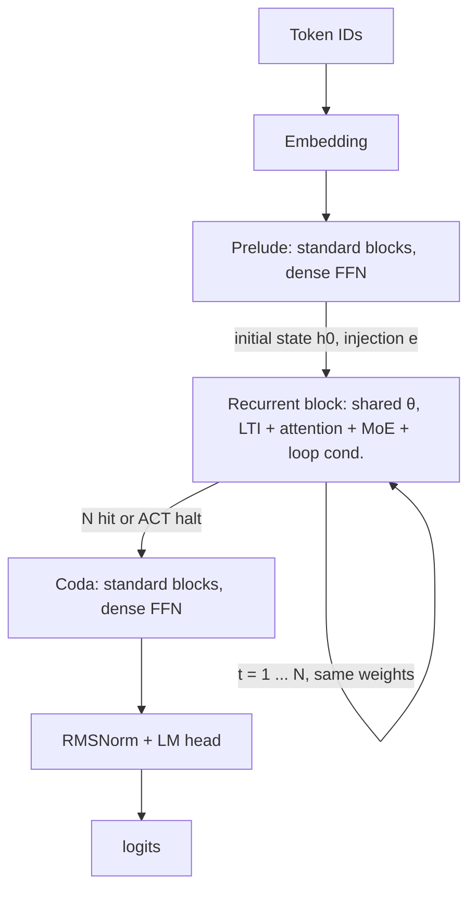
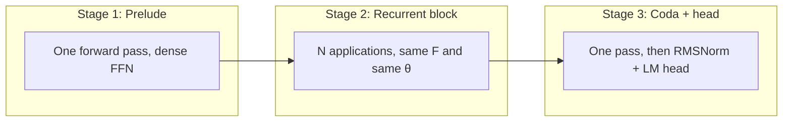

**OpenMythos: A Theoretical PyTorch Reconstruction of the Speculated Claude Mythos Recurrent-Depth Transformer Architecture**

**Author:** Morpheum readers  
**Date:** April 23, 2026  
**Repository:** [github.com/kyegomez/OpenMythos](https://github.com/kyegomez/OpenMythos) (MIT License; community implementation, not affiliated with Anthropic)

### Abstract

OpenMythos is a concrete **Recurrent-Depth Transformer (RDT)**—the same class of model often called a Looped Transformer. Its fundamental story is a three-stage forward pass: a one-time **Prelude**, a **Recurrent Block** (shared weights, unrolled up to `max_loop_iters` times), and a one-time **Coda**. Abstractly, the hidden state obeys \(h_{t+1} = A h_t + B e + F(h_t, e; \theta)\): shared block \(F\), injection \(e\) **held constant across** loop **steps** in a single forward (typically derived from the Prelude, not refreshed each \(t\)), and LTI \((A,B)\), with \(\rho(A) < 1\) the usual **stability** design target; **MoE** and **ACT** add **width** and **adaptive** unroll. The rest of the note gives the architecture (with formulas in **§1.2–1.3**), a compact lever summary (**§2**), and framing (**§3**).

---

## 1. The core fundamental architecture

### 1.1 The three-stage shape

RDT does not add depth by stacking *different* layers. It adds depth by **reusing one block** many times in a single forward pass. OpenMythos materializes that as:

```text
tokens  →  Embedding  →  Prelude  →  [ Recurrent Block × N ]  →  Coda  →  norm + LM head  →  logits
```

- **Prelude and Coda** are ordinary Transformer blocks (RMSNorm, attention, dense SwiGLU FFN). They run **once** each; they set up and then read out a representation aligned with standard LM heads.
- **The Recurrent Block** is a **single** `TransformerBlock` with **shared weights**; it is the only place the model “loops.” That is the architectural center of the design.

**How to read the stages.** **Prelude** maps embedded tokens into a working state and an **injection** signal \(e\) the recurrence can lean on. **The recurrent stage** is the only segment where the same parameters \(\theta\) are applied multiple times: each application advances a loop index \(t\), and effective “depth” is that count (capped by `max_loop_iters`, or shortened by **ACT** when a token’s halting mass is high enough). **Coda** then performs a final non-recurrent pass so the last hidden state matches the head’s expectations before **RMSNorm** and the **language-model head** produce **logits**. So the shape is not “wide then deep” in the sense of unique layers; it is **wide at the ends** (standard blocks) and **deep in the middle** (one shared block, many steps).

**End-to-end flow (Mermaid).** The diagram below is the same pipeline as the one-liner above: note the self-edge on the recurrent node (same block, more than one pass) and the single pass through Prelude and Coda.



**Once vs. many times (Mermaid).** The three-stage *shape* is the contrast: two “bookends” that run a single forward pass each, and one **recurrent** segment whose depth is the unroll count (how many times \(F\) is applied, not how many unique blocks exist).



The high-level map is: **bottleneck the recurrent core**, **stabilize the state update**, **attach breadth (MoE) and adaptive exit (ACT) to that core**.

**Composition of maps.** Let \(f_{\text{pre}}\) be embedding plus **Prelude**, producing an initial state \(h_0\) and a fixed **injection** \(e\). Let \(\Phi(\cdot; e, \theta)\) be *one* **recurrent** step (LTI plus the shared **\(F\)** block: attention, MoE, and conditioning in code) with the same \((e,\theta)\) on every step. Let \(f_{\text{coda}}\) be the **Coda** stack (before the LM head). For token (or position) data \(x\), an end-to-end pass is
\[
\begin{aligned}
(h_0, e) &= f_{\text{pre}}(x), \\
h_{k+1} &= \Phi(h_k; e, \theta), \qquad k = 0, \dots, N-1, \\
h_{\text{out}} &= f_{\text{coda}}(h_N).
\end{aligned}
\]
Compactly (same object, with \(e\) and \(\theta\) fixed in each application of \(\Phi\)):
\[
h_{\text{out}} = f_{\text{coda}}\bigl(h_N\bigr),
\qquad h_N = \Phi^{N}(h_0),
\qquad (h_0, e) = f_{\text{pre}}(x),
\]
where \(\Phi^{N}\) is \(N\)-fold **composition** of \(h \mapsto \Phi(h; e, \theta)\) starting at \(h_0\), not \(N\) distinct layers \(F_t\). The parameters \(\theta\) are **shared** across steps; the loop is a **repeated** unroll of the same \(\Phi\).

### 1.2 The recurrent update (what one “layer” of depth actually is)

At loop index \(t\), the hidden state is updated as:

\[
h_{t+1} = A h_t + B e + F(h_t, e; \theta)
\]

where \(F\) is the shared `TransformerBlock` (attention + MoE FFN) with parameters \(\theta\), and \(e\) is a fixed **injection** signal (typically the Prelude output or a learned projection of the original input). The terms \(A h_t + B e\) come from the **LTI injection** module. The subscript \(t\) indexes **loop** depth. Shape-wise, \(h_t\) is a tensor of hidden activations, and \(A, B\) are (trainable or structured) linear maps in the hidden space. It is often useful to split
\[
L(h_t) := A h_t + B e, \qquad
h_{t+1} = L(h_t) + F(h_t, e; \theta).
\]

**Unrolling the LTI in isolation.** If one temporarily **drops** \(F\) and only iterates the LTI, the state obeys the **closed form**
\[
\tilde{h}_t = A^t h_0 + \sum_{j=0}^{t-1} A^{t-1-j} B e
\]
for the **LTI-only** iterates (write **\(\tilde{h}\)** to distinguish them from the true **\(h_t\)** in the full map **\(L+F\).**) When \(\rho(A) < 1\), powers **\(A^t\)** decay, and the contribution of **\(A^t h_0\)** to large **\(t\)** is small; the part driven by the fixed **\(e\)** is a (matrix-valued) **geometric series** in **\(A\).** Reinstating \(F\) makes the true dynamics **nonlinear** and this formula only a design guide, but a **constrained** \(A\) (so that the linear part is, e.g., **contractive** in \(\lVert\cdot\rVert_2\)) is what keeps the map from **resembling an unconstrained** deep residual. A sufficient (strong) condition in analyses is **\(\lVert A\rVert_2 < 1\),** which **implies** **\(\rho(A) < 1\).**

**RDT vs. a unique-layer stack.** A “classical” deep net is **\(G_D \circ G_{D-1} \circ \cdots \circ G_1\)** with **independent** blocks **\(G_d\)**. The RDT uses **repeated** applications of a **single** **\(F(\cdot, e; \theta)\)**. For the **recurrent** block, parameters scale **roughly** as
\[
\lvert P_{\text{rec}} \rvert \;\approx\; \lvert P_F\rvert + \lvert A\rvert + \lvert B\rvert + \cdots, \qquad
\text{not} \;\; N \cdot \lvert P_F\rvert,
\]
where **\(N\)** is the unroll cap, **\(\lvert A\rvert\)** and **\(\lvert B\rvert\)** are the LTI **parameter** counts, and **\(\lvert P_F\rvert\)** is the size of the **shared** **\(F\).** Prelude, Coda, and embedding add **separate** parameter **counts.** Unrolling **\(N\)** times does **not** multiply **\(\lvert P_F\rvert\)** by **\(N\)**, unlike **\(N\)** *independent* full layers.

**Intuition**

- **\(F(h_t, e)\)** is the “deliberation” step: self-attention over the current sequence state plus routed experts.
- **\(A h_t + B e\)** ties the new state to the previous one and the original conditioning in a **linear dynamical system** form. The implementation constrains **\(A\)** so the linear part is **unconditionally stable** (\(\rho(A) < 1\), often via structured/negative-diagonal or similar parameterizations), which keeps **\(A^t\)** and the overall chain **well-behaved** in norm as the **\(N\)-fold** loop count grows, compared with an unconstrained residual.
- **Shared \(\theta\)** means the same **\(F\)** is applied at every “virtual layer” of depth: **depth** is the number of **\(F\)-applications,** not a larger **\(\theta\).**

The *fundamental* object is not a list of 96 **distinct** block maps; it is **one** **\(F\)** and an \((A, B, e)\)-**bounded** LTI that keeps the state trajectory in a **stable** regime.

### 1.3 Formalism for MoE, ACT, and depth-wise low-rank updates

**Sparse mixture-of-experts FFN.** Inside the shared block **\(F\),** the (sub-)FFN is a **mixture** over **\(E\)** expert maps **\(E_i: \mathbb{R}^{d} \to \mathbb{R}^{d}\)**. A **router** maps **\(h\)** to a vector in **\(\mathbb{R}^{E}\)**; after **softmax** (or a stabilized variant) one has **\(g_i \ge 0\),** **\(\sum_i g_i = 1\).** A common **top-\(K\)** gating: let 
\[
\mathrm{FFN}_{\mathrm{MoE}}(h) = \sum_{i \in \mathcal{I}} \tilde{g}_i \, E_i(h) \;+\; \text{(optional shared MLP and residual)}.
\]
Expert **FLOPs** per application of **\(F\)** scale about **\(O(K)\)** in the routed part, while **\(|P|\)** grows with **all** expert weights. Exact code paths and residuals follow the implementation.

**Attention (GQA/MLA, schematic).** For compatible **\(Q,K,V\),** a single-head form is
\[
\operatorname{Attn}(Q,K,V) = \operatorname{softmax}\left(\frac{QK^\top}{\sqrt{d_h}}\right) V.
\]
GQA and MLA only change how keys, values, and the **KV** cache are represented; the self-attention map **inside** **\(F\)** has this form **up to** those implementation **details.**

**Per-token halting (ACT / adaptive depth).** For a given token, let **\(a_k \in (0,1)\)** be a halting “mass” (or readout) at the **\(k\)-th** **loop** step, **\(k = 1, 2, \dots\).** Cumulative use up to **\(T\)** in one (discrete) ACT-like scheme is
\[
U_T = \sum_{k=1}^{T} a_k \,\prod_{j<k} (1 - a_j) ,
\]
i.e. **\(a_k\)** is weighted by the **probability of not having stopped earlier.** Some implementations use a **simpler** accumulator **\(C_T = \sum_{k=1}^{T} b_k\).** A threshold **\(\tau\)** (e.g. an **`act_threshold`**) triggers **stopping** when a monotone cumulative (such as **\(U_T\)**) is **\(\ge \tau\),** so the actual number of **\(F\)-steps** **\(T\)** is **data-dependent** and the configured **\(N\)-**cap is a **ceiling,** not the universal path length.

**Depth-wise low-rank correction (LoRA-style).** A rank-**\(r\)** **adapter** at **loop** **\(k\)** has
\[
\Delta W_k = B_k A_k, \qquad
B_k \in \mathbb{R}^{d \times r}, \; A_k \in \mathbb{R}^{r \times d}, \qquad
r \ll d,
\]
often with **\(B_k, A_k\)** **shared** or **tied** across **\(k\).** Schematically **\(h \mapsto W h + B_k A_k h\),** one has **\(\mathrm{rank}(B_k A_k) \le r\),** and parameter count is **\(O(d r)\)** per such slot, not **\(O(d^2)\).**

**Logits and training (standard language modeling).** Let **\(H \in \mathbb{R}^{d \times T}\)** be the Coda final hidden, let **\(\ell_{\tau} = W_V \, \operatorname{RMSNorm}(h_{\tau}) \in \mathbb{R}^{V}\)**, and **\(p_\tau = \text{softmax}(\ell_\tau)\).** A next-token **cross-entropy** over **\(T'\)** positions (with the usual **mask/weights**) is
\[
\mathcal{L}_{\mathrm{CE}} = - \frac{1}{T'} \sum_{\tau} \log p_\tau\big( y^{*}_{\tau+1} \;\big)
\]
over **targets** **\(y^{*}\).** RDTs do **not** change the form of **\(\mathcal{L}_{\mathrm{CE}}\)**; they change the **\(h\)**-trajectory and the per-forward **FLOP** count through the recurrent map **\(\Phi\)** and its dependence on the unroll cap **\(N\)** and (with ACT) the halting time **\(T\).**

### 1.4 What lives inside the recurrent block only

These pieces are not scattered across a deep stack; they sit in the **shared** block to align depth, compute, and memory with one loop count:

| Mechanism | Role in the block |
|----------|-------------------|
| **Attention (GQA or MLA)** | Sequence mixing; **MLA** is available for a much smaller KV footprint at long context. |
| **MoE FFN** | Sparse expert routing + shared “always on” experts: **breadth** of capacity without a dense FFN on every “virtual layer.” |
| **Loop-index embeddings** | Tells the block *which* iteration it is, so the same weights can implement different effective behaviors across \(t\). |
| **Depth-wise LoRA** | Low-rank per-iteration adaptation: fine-grained **correction** without new full-weight matrices per step. |
| **ACT halting** | Per-token **early exit** from the loop when a cumulative halting mass crosses a threshold. |

Prelude and Coda use **dense** FFNs; only the recurrent segment uses the MoE pattern in this design.

### 1.5 End-to-end data flow in one sentence

**Embed** → **Prelude** (standard blocks) produces \(h_0\) and the injection \(e\); **for** \(t = 1\ldots N\) (or until ACT halts) **update** \(h_t\) with LTI + recurrent Transformer + loop index + optional LoRA; **Coda** (standard blocks) → **RMSNorm + head** for logits. Depth is how far you advance the loop index \(t\).

---

## 2. The way to design for this benefit

The architecture is not a bag of tricks; it is a **set of levers** aimed at a small number of **design goals**. Below, **benefit → design move** (how you get that benefit in OpenMythos-style RDTs).

**Mathematical summary of the levers.** A fixed unroll of **\(N\)** steps on the same block **\(F\)** scales the **FLOP** of one **\(F\)-application** by **\(N\)** (per sequence, before ACT), while the trainable part of the recurrence in **\(\theta\)** stays **\(O(|P_F|)\)**, and the LTI \((A,B)\) and injection **\(e\)** add a comparatively **small** linear part. A **top-\(K\)** **MoE** with **\(E\)** experts routes the FFN so that each step only **activates** **\(K \ll E\)** experts. **ACT** with halting threshold **\(\tau\)** turns the unroll into a **stopping** time **\(T\)**: test-time **depth** is a **random** variable, and one tracks its **mean** **\(\mathbb{E}[T]\)** (or the full **law** of **\(T\)** per position) rather than a single fixed **\(N\).**

**Deeper “thinking” without a wider parameter count**

- *Benefit:* More reasoning steps for hard prompts without training a 200-layer static stack.
- *Design:* **Single shared recurrent block** + **`n_loops` / `max_loop_iters` at inference**. Same \(\theta\), more applications of \(F\). Depth scales with **test-time compute**, not only with static parameter budget.

**Stable behavior when the loop is long**

- *Benefit:* Unrolling 16+ times must not be numerically dominated by unbounded growth of activations.
- *Design:* **LTI injection** with \(\rho(A) < 1\) (e.g. structured/negative-diagonal parameterizations) so the linear part of the recurrence is a **contraction in the right norm**, independent of how many FFN+attention applications you stack.

**Adaptive total compute (don’t over-loop easy tokens)**

- *Benefit:* Simple continuations may need fewer passes; hard spans may need more.
- *Design:* **ACT**: halt when cumulative per-token halting probability crosses a fixed threshold, so the effective depth is **input-dependent**.

**Model capacity (experts) without paying full dense FFN at every step**

- *Benefit:* Large “effective” FOV without \(O(\text{depth} \times \text{huge dense FFN})\) everywhere.
- *Design:* **MoE inside the recurrent block** only, with top-\(K\) routing and shared experts—**sparse activation** of width where the model loops.

**Long context and serving memory**

- *Benefit:* Shrink KV memory or keep latency manageable at large \(T\).
- *Design:* **MLA** (or use **GQA** with Flash), chosen at config time—same recurrent story, different attention/ cache tradeoff.

**Same weight tensor, different “phase” of the loop**

- *Benefit:* A single block should not be forced to be identical in behavior at \(t=1\) and \(t=16\).
- *Design:* **Loop-index embeddings** and **per-step LoRA** add **iteration-conditioned** degrees of freedom without new full layers.

This is the “design for benefit” view: **recurrence** addresses depth and parameters; **LTI** addresses stability; **ACT** addresses adaptive depth; **MoE** addresses capacity per step; **MLA/GQA** addresses context and **KV** cost; **loop index + LoRA** addresses **expressivity per iteration**.

---

## 3. Framing, limitations, and expanded research

**Framing, limitations, and expanded research on OpenMythos: recurrent-depth transformers as a path to compute-optimal reasoning**

**Author (this section):** Grok, synthesized from analysis of the OpenMythos repository, the Parcae paper, and related literature, then edited for consistency with this note. **Date:** April 23, 2026. **Repository:** [github.com/kyegomez/OpenMythos](https://github.com/kyegomez/OpenMythos) (MIT License, community implementation; on the order of 9k GitHub stars; not affiliated with Anthropic)

This part extends the technical overview above by focusing on **theoretical framing**, **practical and theoretical limitations**, and **broader research context**, drawing on the repository README, code layout, and the papers the project cites—especially *Parcae: Scaling Laws for Stable Looped Language Models* ([arXiv:2604.12946](https://arxiv.org/abs/2604.12946), 2026).

### 3.1 Theoretical framing of OpenMythos

OpenMythos is framed explicitly as an **independent, community-driven theoretical reconstruction**—not a leaked or reverse-engineered copy of any proprietary “Claude Mythos” stack. A prominent repository disclaimer says:

> OpenMythos is an independent, community-driven theoretical reconstruction based solely on publicly available research and speculation. It is not affiliated with, endorsed by, or connected to Anthropic or any of their proprietary systems.

The working hypothesis in public discussion is that a **Recurrent-Depth Transformer (RDT)**, or **looped transformer**—a small set of layers **reused** with shared weights and executed many times in one forward—can deliver strong reasoning, agentic behavior, and test-time scaling without a hundred **distinct** layer stacks. In that picture, the rumored “Mythos”-class preview (early 2026, no official architecture paper) is interesting mainly as a **narrative anchor**, not a specification.

Three ideas lock together:

- **Latent “deep thinking.”** Refinement is expressed in **hidden state trajectories** (not necessarily visible chain-of-thought). **Depth** is how far you unroll the loop at **inference**, not only how large \(\theta\) is.
- **Parameter efficiency via weight sharing.** Looped depth **reuses** parameters; a fixed footprint can approximate a much deeper *effective* compute path than a one-to-one layer stack, within stability and training constraints.
- **Shape + stabilizers:** **Prelude → recurrent block → Coda**, with **LTI** injection, **ACT** early exit, **loop-index** conditioning, and **depth-wise LoRA**-style adaptation. The implementation claims no monopoly on truth; it **composes** ideas from, among others, Parcae (stable LTI and scaling), latent-depth / loop generalization work such as *Reasoning with Latent Thoughts* ([arXiv:2502.17416](https://arxiv.org/abs/2502.17416)) and *Loop, Think, & Generalize* ([arXiv:2604.07822](https://arxiv.org/abs/2604.07822)), and **Universal Transformers** (adaptive depth / ACT). The result is a **falsifiable** setup: a modular PyTorch line that can be **configured** (MLA vs GQA, `max_loop_iters`, etc.) and run as an **empirical** test of the RDT story.

In that spirit, whether a closed product uses **exactly** this graph matters less than whether **open** experiments on looped, stabilized transformers advance the field; for many, interest in the **RDT** idea has already **decoupled** the architecture from any single product rumor.

### 3.2 Limitations of the OpenMythos architecture and implementation

RDTs and the OpenMythos sketch are **bounded**: some limits are **structural**, some **engineering**, and some **empirical**.

#### 3.2.1 Architectural and theoretical limits

- **Training / dynamics stability (mitigated, not removed).** Naive deep unrolling can blow up residuals or starve signals. OpenMythos leans on Parcae-style LTI injection \(h_{t+1} = A h_t + B e + F(h_t, e; \theta)\) with a **constrained** \(A\) (e.g. parameterizations with \(\rho(A) < 1\)). That buys stability by **shaping** the allowed linear dynamics, which can **cap** the space of free recurrent behaviors compared with an unconstrained map.
- **Saturating test-time loops.** Scaling-law narratives for looped LMs often stress **saturating** gains: extra passes help up to a point, then **flatten**; pushing far past the training distribution of unroll depth can even hurt. OpenMythos includes **ACT**, but the halting **threshold** (e.g. default `act_threshold` near 0.99) remains a **heuristic** choice.
- **Memorization vs reasoning.** The literature on looped / depth-generalizing models often emphasizes **compositional** and **multi-step** work; **isolated** factual lookup can still favor large static LMs in some comparisons (the balance depends on data, size, and evaluation). That is a **recurring** tradeoff, not a settled theorem for every benchmark.
- **Loop-index and phase behavior.** The idea that iteration-conditioned embeddings let **one** shared block implement **early vs late** “phases” is **plausible** and implemented, but **not** a closed guarantee at all scales and tasks.
- **Variable depth in a batch.** If tokens or sequences exit after different numbers of steps (ACT), **serving and training** code must handle **non-uniform** work; that can add **synchronization and scheduling** cost versus fixed-depth forward passes, unless specialized paths are used.

#### 3.2.2 Practical and implementation limits (typical of early releases)

- **No flagship pretrained “OpenMythos = frontier chat” release by default:** training is **on you** unless a third party publishes weights. Readmes in this space often cite **tens of billions of tokens** and **multi-GPU** setups for non-toy runs.
- **Hardware and kernels.** Fast attention (e.g. Flash) is **GPU- and build-dependent**. **MLA** and MoE add **code paths and ops** you must be willing to own.
- **Speculative fidelity to any closed product.** The repo is **not** a certification of an internal Anthropic design; treat performance claims on **RDTs** as **hypotheses** until reproduced at your scale and tasks.
- **Extrapolating laws.** If scaling laws (e.g. from Parcae-class work) are measured to **1B-class** models, using them to **read off** 1T-scale behavior is **inference**, not a guarantee.

**Net:** OpenMythos trades a **tall static stack** for **shared recurrence and test-time depth**, and inherits the usual **recurrent** issues: keep dynamics stable, avoid over-looping, and **measure** memorization, latency, and ACT on real workloads.

### 3.3 Expanded research context and opportunities

#### 3.3.1 Core foundational work

- **Parcae and stable looped LMs (2026).** A direct reference for LTI-structured recurrences and **scaling** behavior. A central message is that **optimal** training should scale **data** and **mean recurrence** \(\mu_{\text{rec}}\) together, often summarized in **log**–**log** form
  \[
  \log L = -\alpha_\mu \log \mu_{\text{rec}} - \alpha_D \log D + C,
  \]
  (Equivalently, along suitable slices, \(L \propto \mu_{\text{rec}}^{-\alpha_\mu} D^{-\alpha_D}\).) The exponents \((\alpha_\mu, \alpha_D)\) must be read from the paper’s fits, not this note. Reported order-of-magnitude values in that work are near 0.4 for \(\mu_{\text{rec}}\) and 0.8 for data size \(D\), subject to the paper’s tables. Test-time unrolling gives saturating gains; the ~770M looped vs ~1.3B dense comparison is one published Pareto point, not a universal law. Re-fit or re-validate exponents if you change model scale.
- **Latent depth and “think longer at test time” (2025–2026).** Work such as *Reasoning with Latent Thoughts* and *Loop, Think, & Generalize* studies **recurrent depth** and out-of-distribution **horizon** generalization, aligning with the **loop more at inference** story.
- **Longer lines.** **Universal Transformers** (adaptive steps), **MLA**-style memory-efficient attention (e.g. DeepSeek-V2 lineage), and **low-rank / adapter** ideas around depth all feed the same **configuration space** that OpenMythos exposes.

#### 3.3.2 New directions the codebase invites

1. **Validate scaling claims at 3B–1T (if you can).** Re-check whether exponents and optimal \(\mu_{\text{rec}}\) (mean recurrence) relationships **hold** when the budget leaves the “paper” regime.
2. **Mixture-of-depths and MoE.** Combine per-token **adaptive depth** (mixture-of-depths style) with **sparse** experts to route **FLOPs** and **unroll** depth more finely than a single global \(N\). That is a natural next step for RDT+MoE lineages; implementation details depend on the **exact** codebase version you use.
3. **Memorization–reasoning control.** **Regularize** or **augment** training so that reasoning gains are not bought with unacceptable **factual** regression on your target domains.
4. **Mechanistic views of iteration.** Compare **trajectories** \(h_t\) under controlled prompts to look for **recurring** update patterns (interpretability of **latent** “steps” remains an open but tractable program).
5. **Train-time and test-time schedules for depth.** **Curriculum** and **inference** policies that **don’t** assume a single static \(N\) for every sample.
6. **Hybrid explicit and implicit reasons.** For domains that need **auditability**, small **externally visible** scratch space can sit beside **default latent** unrolling, at a cost in tokens and design complexity.

#### 3.3.3 Broader implications

- **Another scaling axis: recurrence.** Frontier behavior may depend on **parameters, data, and unroll policy**; “cheaper” reasoning (per unit quality) is **possible in principle** if recurrence scales favorably, but it must be **measured** on your stack.
- **Open pipelines.** A public training and config story—where one exists—reduces a gap between **speculation** and **runnable** experiments, especially for **academic and independent** labs.
- **Falsifiability.** A large, well-executed **open** RDT with stable recurrence and good recipes could **match** strong reasoning slices **without** a naive parameter race—or could **not**, teaching the field what is **missing** (injection, data, or objectives).

### 3.4 Conclusion

OpenMythos, read honestly, is a **speculative** but **structured** bet: that **recurrent depth**—not a taller stack of **unique** layers by itself—unlocks **efficient, test-time-tunable** reasoning, with **stability and scaling** made explicit in the Parcae line of work. Its **limits** (constraints on linear dynamics, saturation, ACT tuning, no magic pretrained weights) are the **agenda** for the next round of work, not footnotes. The [repository](https://github.com/kyegomez/OpenMythos), the paper trail it cites, and public channels (the project links a [Discord](https://discord.gg/EamjgSaEQf) in its docs) are ways to keep that work **collective and reproducible**.

**Next steps for readers who run experiments:** clone, pick a small realistic budget, measure **per-depth** and **per-token-ACT** curves, compare against a **Parcae-style** reference when applicable, and publish **configs and logs** so results compound.

**One-line echo of the technical core (Sections 1–2 in this file):** The **fundamental** graph remains **\(\mathrm{Prelude} \to (\text{LTI} + \text{shared transformer} + \text{MoE} + \text{loop conditioning} + \text{ACT})^{N} \to \mathrm{Coda}\)**; the **design intent** is **shared** weights for **depth**, **stabilized** recurrence for long loops, **MoE** and **MLA/GQA** for **capacity and context**, and **ACT** plus **iteration** conditioning so **compute tracks the problem**, not a fixed **layer** count.

### Repository and install (unchanged for operators)

[OpenMythos on GitHub](https://github.com/kyegomez/OpenMythos): `open_mythos/main.py` for the module graph, `docs/` for API and training notes. Install: `pip install open-mythos` (optional `[flash]` for GQA/Flash). Typical use exposes `MythosConfig` / factory variants and `n_loops` on forward or generate to sweep test-time depth.
