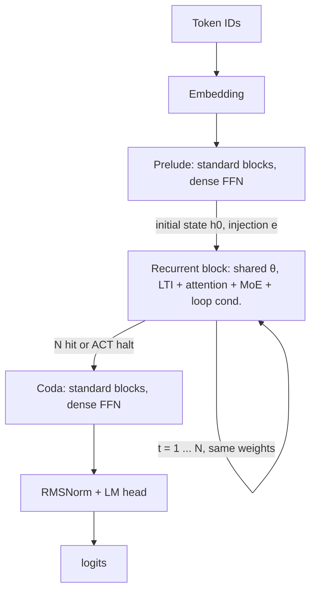
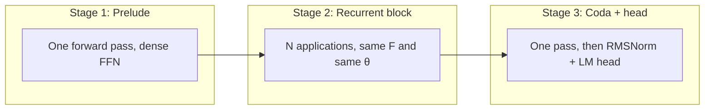

**OpenMythos: A Theoretical PyTorch Reconstruction of the Speculated Claude Mythos Recurrent-Depth Transformer Architecture**

**Author:** Morpheum readers  
**Date:** April 23, 2026  
**Repository:** [github.com/kyegomez/OpenMythos](https://github.com/kyegomez/OpenMythos) (MIT License; community implementation, not affiliated with Anthropic)

### Abstract

OpenMythos is a concrete **Recurrent-Depth Transformer (RDT)**—the same class of model often called a Looped Transformer. Its fundamental story is a three-stage forward pass: a one-time **Prelude**, a **Recurrent Block** (shared weights, unrolled up to `max_loop_iters` times), and a one-time **Coda**. Inside the loop, the state evolves through a **stable linear recurrence** (LTI injection) plus a Transformer block with **sparse MoE** feed-forward, so “depth” is an inference-time choice as much as a static stack of layers. The rest of the paper is organized around that idea: first the **core architecture** (how signals flow and why the recurrence is written the way it is), then **how to design for the benefits** (which mechanism buys which property).

---

## 1. The core fundamental architecture

### 1.1 The three-stage shape

RDT does not add depth by stacking *different* layers. It adds depth by **reusing one block** many times in a single forward pass. OpenMythos materializes that as:

```text
tokens  →  Embedding  →  Prelude  →  [ Recurrent Block × N ]  →  Coda  →  norm + LM head  →  logits
```

- **Prelude and Coda** are ordinary Transformer blocks (RMSNorm, attention, dense SwiGLU FFN). They run **once** each; they set up and then read out a representation aligned with standard LM heads.
- **The Recurrent Block** is a **single** `TransformerBlock` with **shared weights**; it is the only place the model “loops.” That is the architectural center of the design.

**How to read the stages.** **Prelude** maps embedded tokens into a working state and an **injection** signal \(e\) the recurrence can lean on. **The recurrent stage** is the only segment where the same parameters \(\theta\) are applied multiple times: each application advances a loop index \(t\), and effective “depth” is that count (capped by `max_loop_iters`, or shortened by **ACT** when a token’s halting mass is high enough). **Coda** then performs a final non-recurrent pass so the last hidden state matches the head’s expectations before **RMSNorm** and the **language-model head** produce **logits**. So the shape is not “wide then deep” in the sense of unique layers; it is **wide at the ends** (standard blocks) and **deep in the middle** (one shared block, many steps).

**End-to-end flow (Mermaid).** The diagram below is the same pipeline as the one-liner above: note the self-edge on the recurrent node (same block, more than one pass) and the single pass through Prelude and Coda.



**Once vs. many times (Mermaid).** The three-stage *shape* is the contrast: two “bookends” that run a single forward pass each, and one **recurrent** segment whose depth is the unroll count (how many times \(F\) is applied, not how many unique blocks exist).



The high-level map is: **bottleneck the recurrent core**, **stabilize the state update**, **attach breadth (MoE) and adaptive exit (ACT) to that core**.

### 1.2 The recurrent update (what one “layer” of depth actually is)

At loop index \(t\), the hidden state is updated as:

\[
h_{t+1} = A h_t + B e + F(h_t, e; \theta)
\]

where \(F\) is the shared `TransformerBlock` (attention + MoE FFN) with parameters \(\theta\), and \(e\) is a fixed **injection** signal (typically the Prelude output or a learned projection of the original input). The terms \(A h_t + B e\) come from the **LTI injection** module.

Intuition:

- **\(F(h_t, e)\)** is the “deliberation” step: self-attention over the current sequence state plus routed experts.
- **\(A h_t + B e\)** ties the new state to the previous one and the original conditioning in a **linear dynamical system** form. The implementation constrains \(A\) so the linear part is **unconditionally stable** (spectral radius \(\rho(A) < 1\)). That is what allows **long unrollings** without the purely residual stack blowing up in norm as \(N\) grows.
- **Shared \(\theta\)** means the same transformation is applied at every “layer” of depth: depth is **how many times** you apply it, not how many distinct parameter tensors you own.

So the *fundamental* object is not a list of 96 unique blocks; it is **one** recurrent block plus a **stability-friendly** state map.

### 1.3 What lives inside the recurrent block only

These pieces are not scattered across a deep stack; they sit in the **shared** block to align depth, compute, and memory with one loop count:

| Mechanism | Role in the block |
|----------|-------------------|
| **Attention (GQA or MLA)** | Sequence mixing; **MLA** is available for a much smaller KV footprint at long context. |
| **MoE FFN** | Sparse expert routing + shared “always on” experts: **breadth** of capacity without a dense FFN on every “virtual layer.” |
| **Loop-index embeddings** | Tells the block *which* iteration it is, so the same weights can implement different effective behaviors across \(t\). |
| **Depth-wise LoRA** | Low-rank per-iteration adaptation: fine-grained **correction** without new full-weight matrices per step. |
| **ACT halting** | Per-token **early exit** from the loop when a cumulative halting mass crosses a threshold. |

Prelude and Coda use **dense** FFNs; only the recurrent segment uses the MoE pattern in this design.

### 1.4 End-to-end data flow in one sentence

**Embed** → **Prelude** (standard blocks) produces \(h_0\) and the injection \(e\); **for** \(t = 1\ldots N\) (or until ACT halts) **update** \(h_t\) with LTI + recurrent Transformer + loop index + optional LoRA; **Coda** (standard blocks) → **RMSNorm + head** for logits. Depth is how far you advance the loop index \(t\).

---

## 2. The way to design for this benefit

The architecture is not a bag of tricks; it is a **set of levers** aimed at a small number of **design goals**. Below, **benefit → design move** (how you get that benefit in OpenMythos-style RDTs).

**Deeper “thinking” without a wider parameter count**

- *Benefit:* More reasoning steps for hard prompts without training a 200-layer static stack.
- *Design:* **Single shared recurrent block** + **`n_loops` / `max_loop_iters` at inference**. Same \(\theta\), more applications of \(F\). Depth scales with **test-time compute**, not only with static parameter budget.

**Stable behavior when the loop is long**

- *Benefit:* Unrolling 16+ times must not be numerically dominated by unbounded growth of activations.
- *Design:* **LTI injection** with \(\rho(A) < 1\) (e.g. structured/negative-diagonal parameterizations) so the linear part of the recurrence is a **contraction in the right norm**, independent of how many FFN+attention applications you stack.

**Adaptive total compute (don’t over-loop easy tokens)**

- *Benefit:* Simple continuations may need fewer passes; hard spans may need more.
- *Design:* **ACT**: halt when cumulative per-token halting probability crosses a fixed threshold, so the effective depth is **input-dependent**.

**Model capacity (experts) without paying full dense FFN at every step**

- *Benefit:* Large “effective” FOV without \(O(\text{depth} \times \text{huge dense FFN})\) everywhere.
- *Design:* **MoE inside the recurrent block** only, with top-\(K\) routing and shared experts—**sparse activation** of width where the model loops.

**Long context and serving memory**

- *Benefit:* Shrink KV memory or keep latency manageable at large \(T\).
- *Design:* **MLA** (or use **GQA** with Flash), chosen at config time—same recurrent story, different attention/ cache tradeoff.

**Same weight tensor, different “phase” of the loop**

- *Benefit:* A single block should not be forced to be identical in behavior at \(t=1\) and \(t=16\).
- *Design:* **Loop-index embeddings** and **per-step LoRA** add **iteration-conditioned** degrees of freedom without new full layers.

This is the “design for benefit” view: **recurrence** addresses depth and parameters; **LTI** addresses stability; **ACT** addresses adaptive depth; **MoE** addresses capacity per step; **MLA/GQA** addresses context and **KV** cost; **loop index + LoRA** addresses **expressivity per iteration**.

---

## 3. Framing and limits (brief)

OpenMythos is a **speculative reconstruction** from public code and papers (recurrent depth, Universal Transformer ideas, DeepSeek-style MLA, Graves’ ACT, Parcae-style scaling claims, etc.), not a confirmed internal blueprint of any closed model. It is best read as: **a runnable articulation of the RDT + stable recurrence + MoE in the loop** hypothesis, with configuration knobs to study tradeoffs.

**Repository entry points:** [OpenMythos on GitHub](https://github.com/kyegomez/OpenMythos) (`open_mythos/main.py` for the module graph, `docs/` for API and training notes). Install: `pip install open-mythos` (optional `[flash]` for GQA/Flash). Typical use exposes `MythosConfig` / factory variants and `n_loops` on forward or generate to sweep test-time depth.

**Bottom line:** The **fundamental** architecture is **Prelude → (LTI + shared Transformer + MoE + loop conditioning + ACT)\(^N\) → Coda**. The **design for benefit** is: share weights for depth, stabilize the recurrence for long loops, add MoE for girth, MLA/GQA for context, and ACT + loop conditioning so compute and expressivity track the problem, not a fixed layer count.
