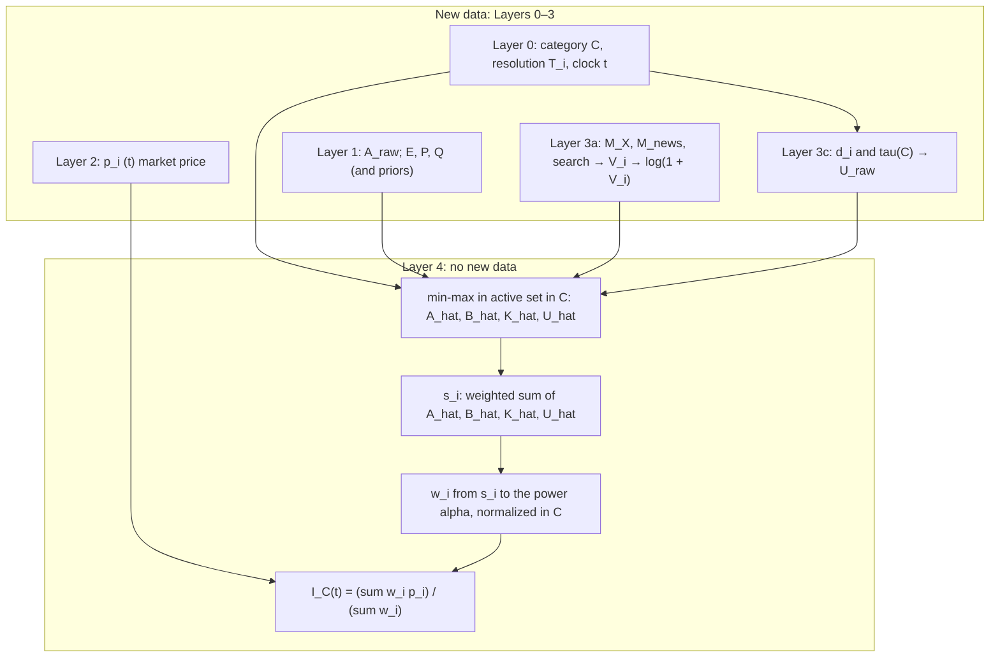
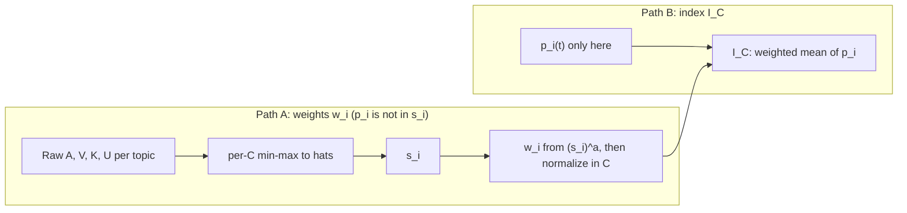

**Technical note**

# The Category Care Index: an importance-weighted, prediction-market index for salient unresolved events

**Version 1.0 · April 2026 · Morpheum Research**

---

### Abstract

High-volume news feeds and generic sentiment measures rarely identify *which* unresolved, forward-looking propositions are simultaneously socially salient, materially consequential, and amenable to probabilistic aggregation. This note specifies the **Category Care Index** (CCI): a family of real-valued indices—one per topical category—that combine (i) live prediction-market probabilities, (ii) model- or agent-derived priors on salience, (iii) exogenous attention proxies, and (iv) time-to-resolution decay, within a single importance-weighted mean. The construction parallels capitalization-weighted sector indices in asset pricing, except that weights reflect composite importance rather than notional value alone. The document states definitions, normalizations, and layer-wise data dependencies, and it outlines an operational recalculation schedule and optional derived quantities (e.g. sector “heat” and a probability-based uncertainty measure).

**Keywords:** prediction markets, importance weighting, attention economics, composite indices, normalization, time decay

---

### 1. Introduction and problem setting

Contemporary information systems exhibit three recurrent limitations. First, **scale**: item counts are large, yet rank orderings rarely encode joint consideration of endogenous agent assessments, exogenous attention, and objective impact. Second, **temporal statics**: “trending” lists often neglect resolution horizons and the differential urgency of short- versus long-dated events. Third, **orientation**: univariate sentiment is predominantly retrospective, whereas decision-relevant public information is frequently best represented as a distribution over future states—precisely the object that prediction-style markets and comparable elicitation mechanisms provide.

The CCI is designed to sit at this interface. For each category \(C\) (e.g. politics, science and technology, sports) and time \(t\), the index aggregates *active*, **unresolved** propositions whose outcomes are associated with a scalar probability \(p_i(t) \in [0,1]\), weighting them by a nonnegative composite **importance** score \(s_i(t)\) and an exponentiated concentration parameter \(\alpha > 1\), then rescaling the result to an interpretable scale (e.g. \(0\)–\(100\)).

**Contributions of this note (methodological, not empirical).** (1) A closed-form definition of \(I_C(t)\) as an importance-weighted mean of market probabilities. (2) A four-component decomposition of \(s_i(t)\) with explicit category-relative min–max normalization. (3) A layered description of the data flow that separates *identity and eligibility* from *price* from *exogenous drivers*, clarifying which quantities enter the weight path versus the index formula alone.

---

### 2. Theoretical definition

Let \(\mathcal{A}_C(t)\) denote the set of **active** (unresolved) topics in category \(C\) at time \(t\). For each \(i \in \mathcal{A}_C(t)\), let \(p_i(t) \in [0,1]\) denote the elicited or market-implied probability of the designated focal outcome at \(t\).

**Definition 1 (category index).** The *raw* category index is the importance-weighted average

\[
I_C(t) = \frac{\sum_{i \in \mathcal{A}_C(t)} w_i(t) \, p_i(t)}{\sum_{i \in \mathcal{A}_C(t)} w_i(t)}
\]

subject to nonnegative weights \(w_i(t)\) defined below. Display values may apply an affine map from the unit interval to \([0,100]\) without loss of the relative ordering within \(C\).

**Definition 2 (concentration weights).** Let \(s_i(t) \geq 0\) be a composite importance score. Topic weights follow a “market-cap” normalization with exponent \(\alpha > 1\):

\[
w_i(t) = \frac{[s_i(t)]^\alpha}{\sum_{j \in \mathcal{A}_C(t)} [s_j(t)]^\alpha}
\]

Values \(\alpha \in [1.6, 2.0]\) increase the influence of the largest scores relative to a linear sum; the exact choice is a design parameter, not identified here from data.

**Remark.** Probabilities \(p_i(t)\) do **not** enter \(s_i(t)\) in the specification below. They enter only through Definition 1. This separation makes the weighting interpretable as exogenous to the contemporaneous level of \(p_i\), and it avoids double-counting when the same information flow updates both “attention to \(i\)” and market prices.

---

### 3. Composite importance score

#### 3.1 Raw component variables

For each active topic \(i\):

- **Agent-native salience** \(A_{\text{raw},i}\), on a fixed bounded scale (e.g. \([0,1]\) or rescaled 1–10) as produced by topic-construction or evaluation agents.  
- **Log attention** \(\tilde{V}_i(t) = \log(1 + V_i(t))\), where \(V_i(t)\) aggregates volume measures (e.g. short-horizon social, news, and optional search counts) over a rolling window of \(24\)–\(72\) hours, domain-dependent.  
- **Stake and impact** \(K_{\text{raw},i}\), a convex combination of normalized subcomponents, e.g. economic exposure \(E_{\text{norm}}\), affected population \(P_{\text{norm}}\), and qualitative impact \(Q_{\text{norm}}\):
  \[
  K_{\text{raw},i} = 0.5\, E_{\text{norm}} + 0.3\, P_{\text{norm}} + 0.2\, Q_{\text{norm}}.
  \]
- **Urgency** with respect to resolution:
  \[
  U_{\text{raw},i}(t) = \exp\!\left(-\frac{d_i(t)}{\tau_C}\right),
  \]
  where \(d_i(t)\) is the remaining time in days to resolution at \(T_i\), and \(\tau_C > 0\) is category-specific (e.g. shorter in sports, longer in science or institutional politics).

#### 3.2 Category-relative min–max normalization

For each raw variable \(X \in \{A, \tilde{V}, K, U\}\) and for fixed \((C,t)\), let \(X_{\text{raw},i}(t)\) be comparable across \(i \in \mathcal{A}_C(t)\). Define

\[
\hat{X}_i(t) = 
\begin{cases}
0, & \text{if } \displaystyle \min_{j \in \mathcal{A}_C(t)} X_{\text{raw},j}(t) = \max_{j \in \mathcal{A}_C(t)} X_{\text{raw},j}(t), \\[0.5em]
\dfrac{X_{\text{raw},i}(t) - \min_{j \in \mathcal{A}_C(t)} X_{\text{raw},j}(t)}{\max_{j \in \mathcal{A}_C(t)} X_{\text{raw},j}(t) - \min_{j \in \mathcal{A}_C(t)} X_{\text{raw},j}(t)}, & \text{otherwise.}
\end{cases}
\]

Thus each \(\hat{X}_i(t) \in [0,1]\) within \(C\) at \(t\), with ties at degenerate extrema mapped to zero to preserve closure.

#### 3.3 Linear composite

The composite score is a convex combination of normalized terms:

\[
s_i(t) = w_A\, \hat{A}_i(t) + w_B\, \hat{B}_i(t) + w_K\, \hat{K}_i(t) + w_U\, \hat{U}_i(t), \qquad
w_A + w_B + w_K + w_U = 1, \quad w_k \geq 0.
\]

A **default** allocation (tunable by \(C\)) is \(w_A=0.35\), \(w_B=0.40\), \(w_K=0.15\), \(w_U=0.10\), reflecting a hypothesis that exogenous attention carries the largest marginal informativeness for *cross-sectional* salience, conditional on the other terms.

#### 3.4 Layered data architecture

The pipeline is not a single flat list; *layers* separate *eligibility* from *price* from *signals that feed* \(s_i\). Layers 0–3 introduce information; **Layer 4** applies only transformations (normalization, \(s_i\), \(w_i\), \(I_C\)).

| Layer | Content | Feeds |
| --- | --- | --- |
| **0 — Identity and eligibility** | Category label, resolution time \(T_i\); defines \(\mathcal{A}_C(t)\), and \(d_i(t)\) for urgency | Scope of min–max; \(U_{\text{raw},i}\) |
| **1 — Agent priors** | \(A_{\text{raw},i}\); optional structured priors for stake/impact (e.g. components of \(Q\), seeds for \(E,P\)) | \(\hat{A}_i\); (partially) \(K_{\text{raw},i}\) after normalization |
| **2 — Market input** | \(p_i(t)\) | **Only** the numerator of \(I_C(t)\); **excluded** from \(s_i(t)\) in this spec |
| **3a — Attention** | Volumes → \(V_i(t)\) → \(\tilde{V}_i(t)=\log(1+V_i(t))\) | \(\hat{B}_i\) (default weight \(w_B=0.40\)) |
| **3b — Stake/impact** | Economic \(E\), population \(P\), qualitative \(Q\) → \(K_{\text{raw},i}\) | \(\hat{K}_i\) |
| **3c — Urgency** | \(d_i(t)\) from \(T_i\); category \(\tau_C\) in \(\exp(-d_i/\tau_C)\) | \(\hat{U}_i\) |
| **4 — Assembly** | No new exogenous data: min–max; \(s_i\); \([s_i]^\alpha\); weights; \(I_C(t)\) | Published index |

*Operational note.* In production, an ordering that resolves Layer 0, attaches Layer 2, refreshes 3a–3c, then runs Layer 4, facilitates fault isolation (e.g. data-source outage vs. clock or \(T_i\) error).

#### 3.5 Diagram: pipeline and separation of \(p_i\) and \(s_i\)

**Layers 0–3 → 4 (per category \(C\), time \(t\))**

**Importance path versus market price**

**Outputs of one run (within \(C\), at \(t\))**

| Output | Description |
| --- | --- |
| Per topic | \(\hat{A}_i,\hat{B}_i,\hat{K}_i,\hat{U}_i\); then \(s_i(t)\), \(w_i(t)\) |
| Per category | \(I_C(t)\) (optionally rescaled to \([0,100]\) for display) |
| Optional | Sibling statistics (see §5) |

---

### 4. Data requirements

**Produced in-system (e.g. by agents).**

- \(A_{\text{raw},i}\), \(p_i(t)\), \(T_i\), category label for \(i\)

**Obtained from external or auxiliary feeds (as available).**

- Social volume, news volume, optional search volume, aggregated into \(V_i(t)\)  
- Stake/impact fields \((E,P,Q)\) via lightweight retrieval or search-assisted annotation  
- Clock \(t\) for \(d_i(t)\)

**Purely algorithmic (no new raw observations).**

- Min–max normalization, fixed or tuned \((w_A,\ldots,w_U)\), and \(\alpha\)

---

### 5. Operational procedure and optional derived indices

**Recalculation cadence (batch or near–real-time).**

1. Reconstruct \(\mathcal{A}_C(t)\).  
2. Ingest or refresh attention and impact fields where the specification requires it.  
3. Apply within-\(C\) min–max to each of \(\hat{A},\hat{B},\hat{K},\hat{U}\).  
4. Compute \(s_i(t)\), then \(w_i(t)\).  
5. Compute \(I_C(t)\); if desired, apply display scaling and release.

**Optional siblings (same pipeline, additional post-processing).**

- **Heat** (illustrative): a normalized total of raw salience, e.g. activity in \(\sum_i s_i(t)\) or \(\sum_i \tilde{V}_i(t)\) after a chosen normalization, to summarize category-level volume of attention.  
- **Uncertainty**: \(\sum_i w_i(t) \cdot 4\, p_i(t)(1-p_i(t))\) as a probability-weighted variance proxy for binary-like \(p_i\) (Bernoulli variance), interpretable as “restlessness” of the implied distribution.

Propositions that resolve before \(t + \Delta t\) are excluded on the next run by construction of \(\mathcal{A}_C\).

---

### 6. Applications, stakeholders, and interpretation

The CCI is intended for **descriptive** monitoring of *which* unresolved, priced propositions in a category jointly concentrate probability mass under an explicit attention–importance map—not for *causal* claims about the sources of that mass. Plausible use contexts include: macro or sector-level dashboards for market participants; editorial prioritization subject to human override; and policy or civil-society monitoring of expectations over institutional outcomes, with appropriate epistemic caveats. Prediction-market platforms may use such an aggregate as a transparent, category-level layer above individual contracts.

**Interpretive caveat.** The index is a function of the construction of \(s_i\), the choice of \(\alpha\), and the integrity of \(p_i\) and \(\mathcal{A}_C\); it should be read as one model in a class of defensible weighting rules, not as a uniquely “true” measure of social importance.

---

### 7. Limitations and extensions

- The baseline treats focal outcomes as binary; multi-outcome or continuous structures may require expected-value or measure-theoretic aggregation.  
- Attention is manipulable; multi-source design and agent-side robustness checks mitigate but do not eliminate this risk.  
- Natural extensions include alternative compositional rules for \(s_i\) (e.g. geometric means), *learned* weights on historical panel data, and exogenous resolution feeds to reduce measurement error in \(T_i\).

---

### 8. Conclusion

The Category Care Index is specified as an importance-weighted mean of elicited probabilities, with weights derived from normalized agent salience, attention, impact, and urgency, and with probabilities excluded from the weighting map for interpretability. The layered formulation clarifies dependencies and supports replication and audit. Full implementation requires only the listed inputs, fixed hyperparameters, and a documented schedule for refresh and resolution-based pruning.

**Further materials.** The present note is self-contained for definition and structure; program-level pseudocode, per-category weight grids, and deployment checklists can be versioned alongside this document as separate artifacts if needed for engineering handoff.
